# Senior Engineer's Complete Compendium

> **Three domains. Every concept. Explained from first principles — with Mermaid diagrams you can render anywhere.**

Paste any diagram block into [mermaid.live](https://mermaid.live) for an interactive render. Mermaid is also natively supported in GitHub markdown, GitLab, Notion, Confluence, and VS Code (Mermaid Preview extension).

---

## Table of Contents

**Part 1 — Java and JVM Internals**
Java Memory Model · Happens-Before · Volatile · Instruction Reordering · Escape Analysis · False Sharing · CAS · ABA Problem · AQS · ForkJoinPool · Virtual Threads · Semaphores · GC Roots · G1 GC · Object Header Layout · Type Erasure · Bridge Methods · Double-Checked Locking · readResolve · SerialVersionUID · StampedLock · NIO Selector · DirectByteBuffer · ClassLoader · JIT Inlining · Deoptimisation · @Transactional Proxy · CGLIB · MethodHandles · VarHandle · TLAB · Sealed Classes · Lock Inflation · Write Barriers · DispatcherServlet · Stream Short-Circuiting · Spliterator · Try-With-Resources

**Part 2 — Databases and Distributed Systems**
Indexing · Clustering · Normalisation · Read Replicas · Replication Modes · Quorum · Consensus · CAP Theorem · BASE vs ACID · MVCC · Snapshot Isolation · 2PC and 3PC · WAL · Checkpointing · Compaction · Bloom Filter · LSM Tree vs B-Tree · Query Planner · Deadlock · Lock Types · Isolation Anomalies · Backpressure · Circuit Breaker · Rate Limiting · CDC · Consistent Hashing · Partitioning · Idempotency · Exactly-Once Semantics

**Part 3 — Frontend Engineering**
Hydration · Islands Architecture · Streaming SSR · Concurrent Rendering · Fiber Architecture · Reconciliation · Virtual DOM · Structural Sharing · Memoization · Stale Closures · Event Loop · Layout Thrashing · Critical Rendering Path · Tree Shaking · Code Splitting · Web Workers vs Service Workers · SharedArrayBuffer · Browser Compositing · GPU Acceleration · Service Worker Lifecycle · Cache Strategies · CORS · CSP · Suspense · Selective Hydration · Server Components · Web Vitals · CRDTs · AbortController · Memory Leaks · Accessibility Tree · ARIA Live Regions

---

# ☕ Part 1 — Java and JVM Internals

---

## Java Memory Model (JMM)

The JMM is the contract between your Java program and the hardware beneath it. Modern CPUs keep per-core caches, so two threads can simultaneously hold different values for the same variable — and both are technically "correct" from their cache's perspective. The JMM doesn't describe hardware behaviour; it defines what the language **guarantees** when you use synchronisation primitives correctly. Without it, the runtime is free to let a thread read from its stale cache forever. Think of it as the rules of a postal system: threads are cities, and the JMM defines when a letter (a write) is guaranteed to arrive at another city (another thread).

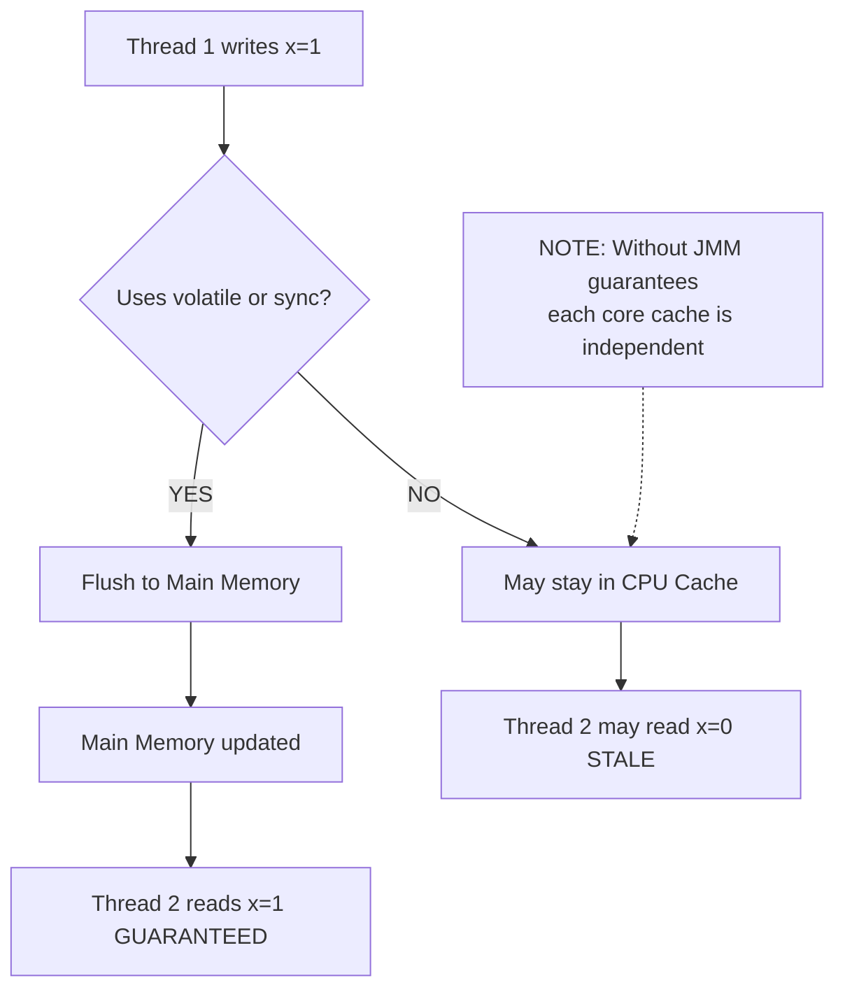
```mermaid
flowchart TD
    A[Thread 1 writes x=1] --> B{Uses volatile or sync?}
    B -- YES --> C[Flush to Main Memory]
    B -- NO --> D[May stay in CPU Cache]
    C --> E[Main Memory updated]
    E --> F[Thread 2 reads x=1 GUARANTEED]
    D --> G[Thread 2 may read x=0 STALE]

    note1[NOTE: Without JMM guarantees\neach core cache is independent]
    note1 -.-> D
```

---

## Happens-Before Relationship

Happens-before is the formal visibility guarantee mechanism inside the JMM. If action A happens-before action B, everything A wrote is **guaranteed visible** to B. This is not about physical time — it is about visibility promises. Key rules: an unlock of a monitor happens-before every subsequent lock of that same monitor; a `volatile` write happens-before every subsequent read of the same field; `thread.start()` happens-before any action in the started thread. The relationship is transitive: if A hb B and B hb C, then A hb C. If no happens-before edge exists between your write and someone else's read, the JVM makes no visibility promise at all.

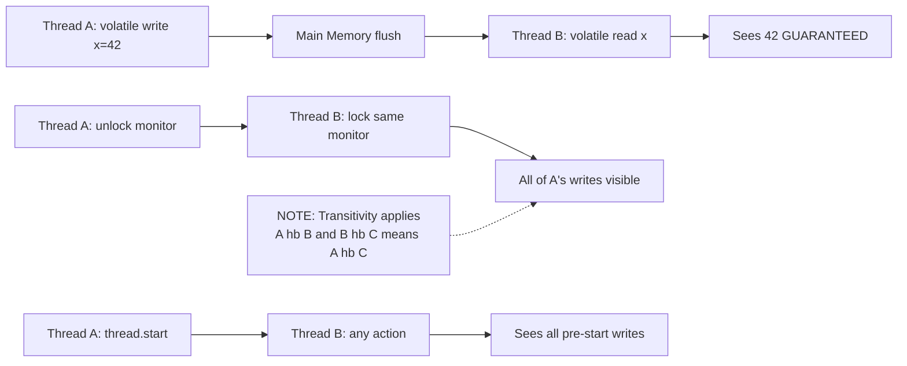
```mermaid
flowchart LR
    W[Thread A: volatile write x=42] --> M[Main Memory flush]
    M --> R[Thread B: volatile read x]
    R --> V[Sees 42 GUARANTEED]

    U[Thread A: unlock monitor] --> L[Thread B: lock same monitor]
    L --> VS[All of A's writes visible]

    S[Thread A: thread.start] --> TA[Thread B: any action]
    TA --> SA[Sees all pre-start writes]

    note1[NOTE: Transitivity applies\nA hb B and B hb C means A hb C]
    note1 -.-> VS
```

---

## Volatile Visibility Guarantees

Declaring a field `volatile` gives two guarantees: **visibility** and **ordering**, but not compound atomicity. On write, the value is immediately flushed to main memory. On read, the value is always fetched from main memory — never from a thread-local cache. This eliminates stale reads. The ordering guarantee acts as a memory fence: all writes before the volatile write are visible to any thread that subsequently reads the volatile field. What volatile *cannot* do is protect compound operations. A volatile `counter++` is still three steps — read, increment, write — and two threads can interleave them, losing an update. For that you need `AtomicInteger` or synchronisation.

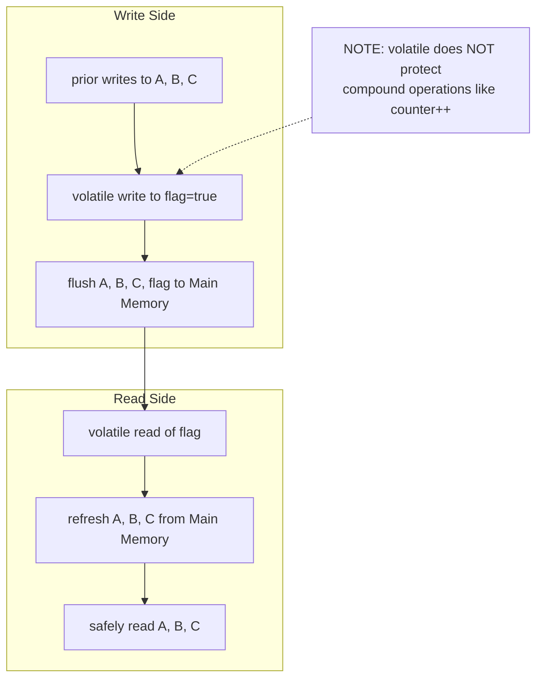
```mermaid
flowchart TD
    subgraph "Write Side"
        W1[prior writes to A, B, C] --> WV[volatile write to flag=true]
        WV --> MM[flush A, B, C, flag to Main Memory]
    end

    subgraph "Read Side"
        RV[volatile read of flag] --> RR[refresh A, B, C from Main Memory]
        RR --> USE[safely read A, B, C]
    end

    MM --> RV

    note1[NOTE: volatile does NOT protect\ncompound operations like counter++]
    note1 -.-> WV
```

---

## Instruction Reordering

Both the compiler and the CPU are free to reorder instructions as long as the result appears correct from a single-threaded perspective. For a single thread this is safe; in a multi-threaded world it is catastrophic. Three sources exist: compiler reordering (the JIT moves instructions for better register use), CPU out-of-order execution (the chip executes instructions in whatever sequence maximises throughput), and memory system reordering (store buffers make writes visible to other cores out of order). The JMM defines exactly which reorderings are permitted and which are forbidden across synchronisation boundaries, giving you predictable behaviour when you use the correct primitives.

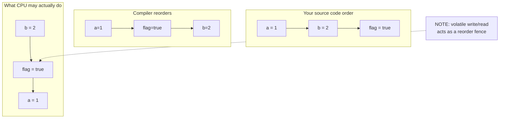
```mermaid
flowchart TD
    subgraph "Your source code order"
        S1[a = 1] --> S2[b = 2] --> S3[flag = true]
    end

    subgraph YOUR ["Compiler reorders"]
        direction LR
        A1[a=1] --> A3[flag=true] --> A2[b=2]
    end

    subgraph "What CPU may actually do"
        E1[b = 2] --> E2[flag = true] --> E3[a = 1]
    end

    note1[NOTE: volatile write/read\nacts as a reorder fence]
    note1 -.-> E2
```

---

## Escape Analysis

Escape analysis is a JIT optimisation that asks: does this object's reference ever leave the current method or thread? If it does not escape, the JVM can allocate it on the thread's stack instead of the heap — stack allocation is essentially free and requires no garbage collection. Even better, the JIT can *scalar-replace* the object: decompose it into its individual fields, stored in CPU registers, and never create an object at all. This is why creating small, short-lived objects in Java is often cheaper than developers expect. The practical lesson is to let the JIT do its job rather than pre-optimising by avoiding object creation.

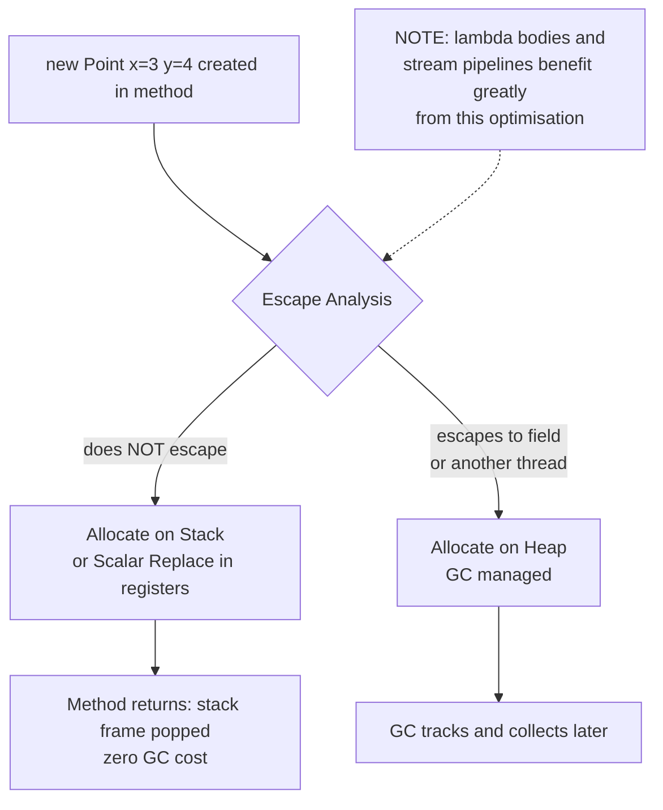
```mermaid
flowchart TD
    OBJ[new Point x=3 y=4 created in method] --> EA{Escape Analysis}
    EA -- does NOT escape --> STACK[Allocate on Stack\nor Scalar Replace in registers]
    EA -- escapes to field\nor another thread --> HEAP[Allocate on Heap\nGC managed]
    STACK --> FREE[Method returns: stack frame popped\nzero GC cost]
    HEAP --> GC[GC tracks and collects later]

    note1[NOTE: lambda bodies and\nstream pipelines benefit greatly\nfrom this optimisation]
    note1 -.-> EA
```

---

## False Sharing

CPUs load memory in cache lines, typically **64 bytes** at a time. False sharing occurs when two threads write to logically independent variables that happen to reside in the same 64-byte cache line. Even though the variables are unrelated, the CPU cache coherency protocol treats them as a single shared unit. Every write by one core invalidates the cache line on all other cores, forcing a re-fetch. The result is that two supposedly independent counters can run slower than a single contended counter. Padding — placing enough dummy bytes between hot fields — fixes this. Java provides the `@Contended` annotation inside `sun.misc` to automate the padding.

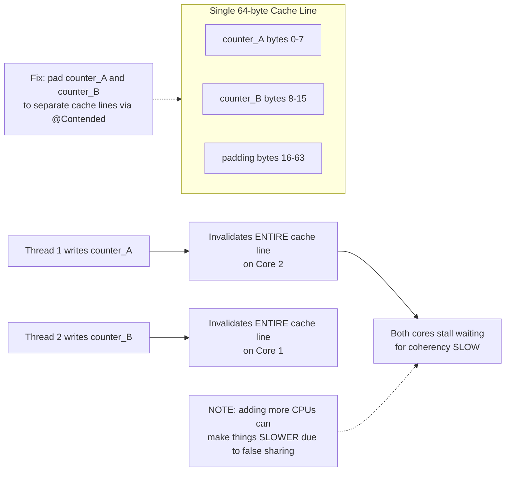
```mermaid
flowchart LR
    subgraph CacheLine ["Single 64-byte Cache Line"]
        direction LR
        CA[counter_A bytes 0-7]
        CB[counter_B bytes 8-15]
        PAD[padding bytes 16-63]
    end

    T1[Thread 1 writes counter_A] --> INVAL[Invalidates ENTIRE cache line\non Core 2]
    T2[Thread 2 writes counter_B] --> INVAL2[Invalidates ENTIRE cache line\non Core 1]

    INVAL --> SLOW[Both cores stall waiting\nfor coherency SLOW]

    FIX[Fix: pad counter_A and counter_B\nto separate cache lines via @Contended]
    FIX -.-> CacheLine

    note1[NOTE: adding more CPUs can\nmake things SLOWER due to false sharing]
    note1 -.-> SLOW
```

---

## CAS — Compare-And-Swap

CAS is a hardware atomic instruction: if the value at this memory address equals the expected value, replace it with the new value — atomically. It returns whether the swap succeeded. This single instruction is the foundation of all lock-free programming in Java. `AtomicInteger.incrementAndGet()` works as a CAS loop: read current value, compute new value, attempt CAS. If another thread changed the value in between, CAS fails and the loop retries. No locks, no context switches, no blocking. Under low contention this is extremely fast. Under high contention the spinning burns CPU — which is why `LongAdder` shards counters across cells and aggregates only on read.

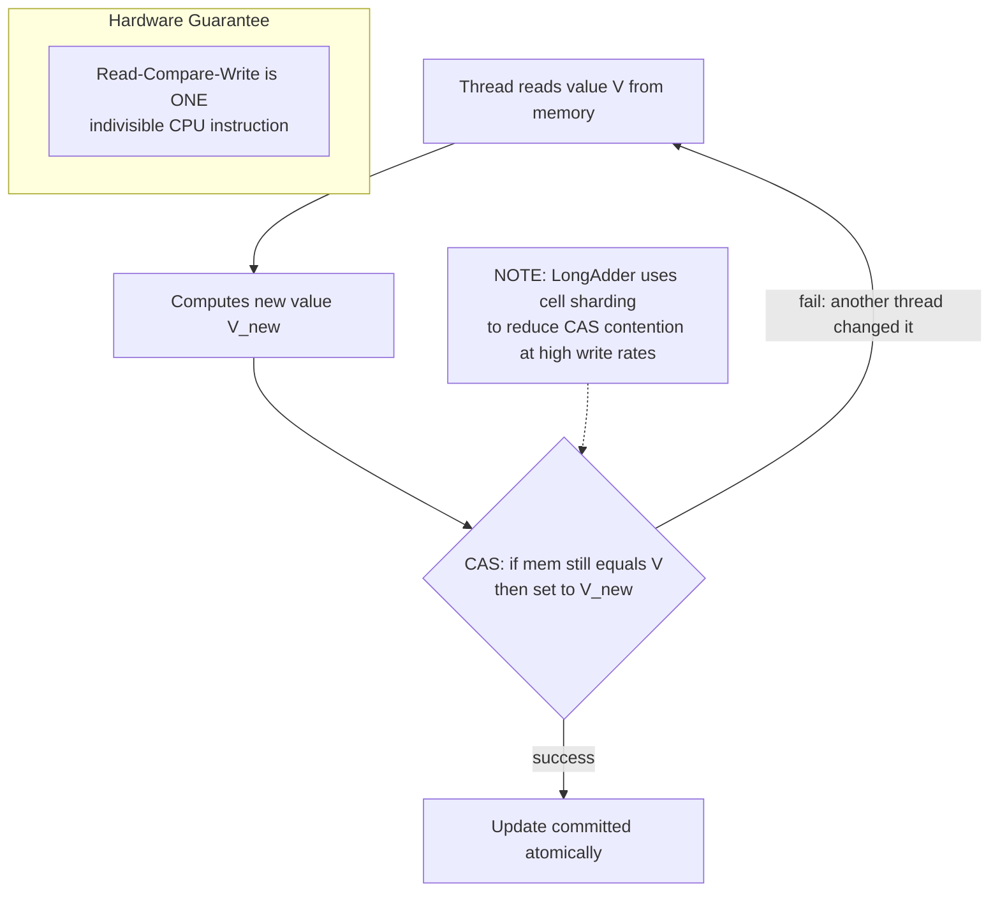
```mermaid
flowchart TD
    START[Thread reads value V from memory] --> COMPUTE[Computes new value V_new]
    COMPUTE --> CAS{CAS: if mem still equals V\nthen set to V_new}
    CAS -- success --> DONE[Update committed atomically]
    CAS -- fail: another thread changed it --> START

    subgraph Hardware Guarantee
        ATOMIC[Read-Compare-Write is ONE\nindivisible CPU instruction]
    end

    note1[NOTE: LongAdder uses cell sharding\nto reduce CAS contention at high write rates]
    note1 -.-> CAS
```

---

## ABA Problem

The ABA problem is a subtle flaw in CAS-based algorithms. Thread 1 reads value A. It is preempted. Thread 2 changes A to B, then back to A. Thread 1 resumes and its CAS succeeds — the memory still reads A. But the object at that address may have been freed and reallocated, or the data structure may have changed, even though the pointer looks the same. The canonical example is a lock-free stack: if nodes are recycled from a pool, the top pointer can return to a previously seen address while the stack's interior is completely different. The fix is `AtomicStampedReference` — every CAS also checks a version stamp that increments on every update.

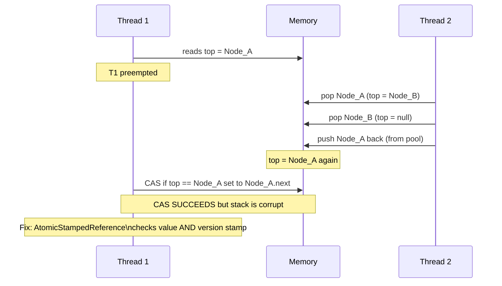
```mermaid
sequenceDiagram
    participant T1 as Thread 1
    participant MEM as Memory
    participant T2 as Thread 2

    T1->>MEM: reads top = Node_A
    Note over T1: T1 preempted
    T2->>MEM: pop Node_A  (top = Node_B)
    T2->>MEM: pop Node_B  (top = null)
    T2->>MEM: push Node_A back (from pool)
    Note over MEM: top = Node_A again
    T1->>MEM: CAS if top == Node_A set to Node_A.next
    Note over T1,MEM: CAS SUCCEEDS but stack is corrupt
    Note over T1: Fix: AtomicStampedReference\nchecks value AND version stamp
```

---

## AQS — AbstractQueuedSynchronizer Internals

AQS is the backbone of Java's concurrency toolkit. `ReentrantLock`, `Semaphore`, `CountDownLatch`, and `ReadWriteLock` all build on it. It provides two things: an integer `state` field and a FIFO queue of waiting threads. The meaning of state is defined by the subclass — for `ReentrantLock`, 0 means unlocked and positive values count reentrancy; for `Semaphore`, state is the permit count. AQS gives you CAS on state and you override `tryAcquire` and `tryRelease`. When a thread cannot acquire, AQS parks it using `LockSupport.park()` and enqueues a node in a CLH-variant linked list. Release unparks the head of the queue. Fair vs unfair modes differ only in whether a new thread can barge in ahead of the queue.

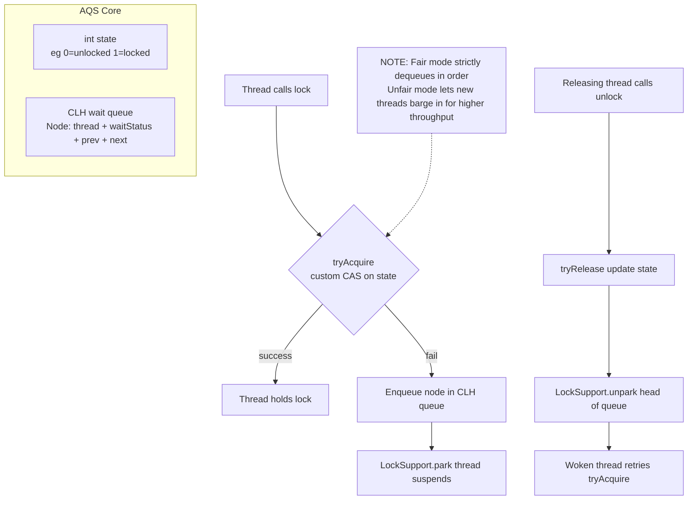
```mermaid
flowchart TD
    subgraph AQS Core
        STATE[int state\neg 0=unlocked 1=locked]
        QUEUE[CLH wait queue\nNode: thread + waitStatus + prev + next]
    end

    TRY[Thread calls lock] --> TRYACQ{tryAcquire\ncustom CAS on state}
    TRYACQ -- success --> HOLD[Thread holds lock]
    TRYACQ -- fail --> ENQUEUE[Enqueue node in CLH queue]
    ENQUEUE --> PARK[LockSupport.park thread suspends]

    RELEASE[Releasing thread calls unlock] --> TRYREL[tryRelease update state]
    TRYREL --> UNPARK[LockSupport.unpark head of queue]
    UNPARK --> RECHECK[Woken thread retries tryAcquire]

    note1[NOTE: Fair mode strictly dequeues in order\nUnfair mode lets new threads barge in for higher throughput]
    note1 -.-> TRYACQ
```

---

## ForkJoinPool

ForkJoinPool is designed for recursive divide-and-conquer parallelism. Its core innovation is **work stealing**: each worker thread owns a double-ended deque of tasks. The owner pushes and pops from the head in LIFO order — good for cache locality. When idle, a thief steals from the tail of another thread's deque in FIFO order — good for fairness and minimising contention. `fork()` submits a subtask to the current thread's deque. `join()` waits, but rather than blocking, the waiting thread helps execute other pending tasks — this is task-joining compensation and prevents thread starvation under deep recursion. `Stream.parallel()` and `CompletableFuture.supplyAsync()` both use the common ForkJoinPool.

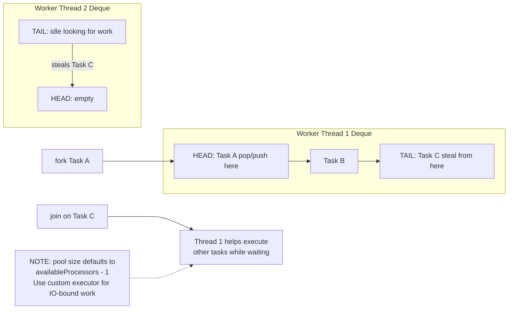
```mermaid
flowchart LR
    subgraph Worker1 ["Worker Thread 1 Deque"]
        direction TB
        H1[HEAD: Task A pop/push here] --> T1[Task B] --> TL1[TAIL: Task C steal from here]
    end
    subgraph Worker2 ["Worker Thread 2 Deque"]
        direction TB
        H2[HEAD: empty]
        TL2[TAIL: idle looking for work]
    end

    TL2 -- steals Task C --> H2

    A[fork Task A] --> H1
    JOIN[join on Task C] --> HELP[Thread 1 helps execute\nother tasks while waiting]

    note1[NOTE: pool size defaults to\navailableProcessors - 1\nUse custom executor for IO-bound work]
    note1 -.-> HELP
```

---

## Virtual Threads

Virtual threads, introduced in Java 21 via Project Loom, are JVM-managed lightweight threads. A platform thread maps one-to-one with an OS thread and requires roughly one megabyte of stack. A virtual thread is **multiplexed**: when it blocks on I/O, sleep, or a lock, the JVM unmounts it from its carrier OS thread and parks its continuation — a snapshot of the call stack. The freed carrier thread immediately picks up another virtual thread. You can have millions of virtual threads with negligible memory overhead. Crucially, you write blocking code as normal — `Thread.sleep()`, blocking I/O — and the JVM transparently converts it to non-blocking. The main caveat is **pinning**: holding a `synchronized` lock while blocking pins the virtual thread to its carrier, negating the benefit.

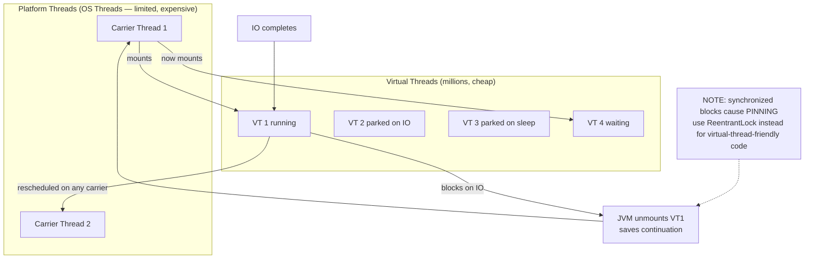
```mermaid
flowchart TD
    subgraph Platform ["Platform Threads (OS Threads — limited, expensive)"]
        PT1[Carrier Thread 1]
        PT2[Carrier Thread 2]
    end

    subgraph Virtual ["Virtual Threads (millions, cheap)"]
        VT1[VT 1 running]
        VT2[VT 2 parked on IO]
        VT3[VT 3 parked on sleep]
        VT4[VT 4 waiting]
    end

    PT1 -- mounts --> VT1
    VT1 -- blocks on IO --> UNMOUNT[JVM unmounts VT1\nsaves continuation]
    UNMOUNT --> PT1
    PT1 -- now mounts --> VT4

    RESUME[IO completes] --> VT1
    VT1 -- rescheduled on any carrier --> PT2

    note1[NOTE: synchronized blocks cause PINNING\nuse ReentrantLock instead for virtual-thread-friendly code]
    note1 -.-> UNMOUNT
```

---

## Semaphores

A semaphore holds a count of **permits**. A thread must acquire a permit to proceed; if none are available it blocks until one is released. Think of a parking lot with N spaces: the semaphore is the gate. This is perfect for rate-limiting access to bounded resources — database connections, API calls, file handles. `Semaphore(1)` behaves like a mutex, but with a critical difference: any thread can release it, unlike an owning lock. This makes semaphores suitable for producer-consumer signalling where one thread signals another. Java's `Semaphore` class is built on AQS, so it inherits fair and unfair modes.

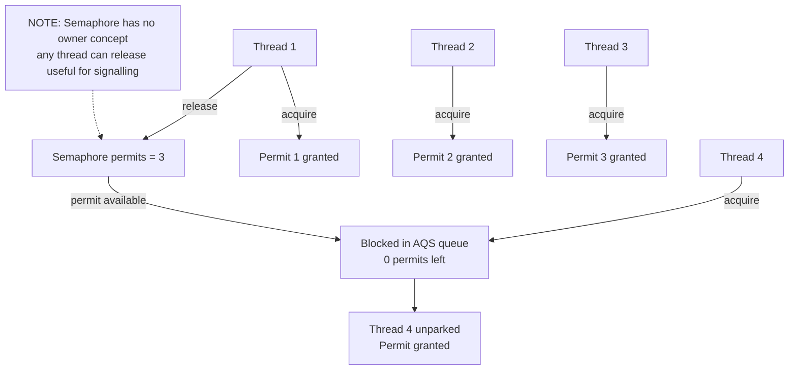
```mermaid
flowchart TD
    SEM[Semaphore permits = 3]
    T1[Thread 1] -- acquire --> P1[Permit 1 granted]
    T2[Thread 2] -- acquire --> P2[Permit 2 granted]
    T3[Thread 3] -- acquire --> P3[Permit 3 granted]
    T4[Thread 4] -- acquire --> BLOCK[Blocked in AQS queue\n0 permits left]

    T1 -- release --> SEM
    SEM -- permit available --> BLOCK
    BLOCK --> P4[Thread 4 unparked\nPermit granted]

    note1[NOTE: Semaphore has no owner concept\nany thread can release useful for signalling]
    note1 -.-> SEM
```

---

## GC Roots

GC roots are the starting points for garbage collection's reachability analysis. The collector traces all object references starting from roots; any object not reachable from a root is garbage. The roots are: local variables and operand stacks in all active thread stack frames; static fields of all loaded classes; JNI native references; references held by JVM internals such as class loaders, interned strings, and synchronised monitors. Active threads themselves are roots — any object reachable from a running thread's stack survives. Memory leaks in Java usually mean you accidentally kept a reference in a long-lived structure without ever removing it. The GC correctly keeps it alive because it is reachable — the problem is your code, not the GC.

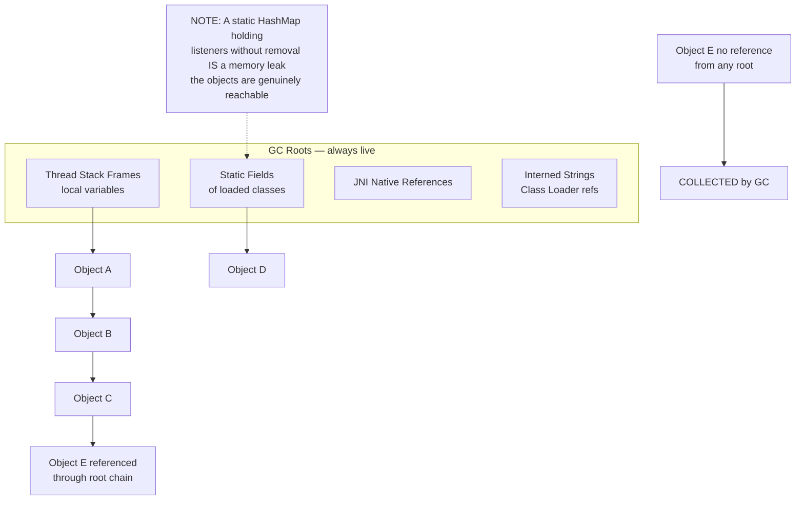
```mermaid
flowchart TD
    subgraph GCRoots ["GC Roots — always live"]
        STACK[Thread Stack Frames\nlocal variables]
        STATIC[Static Fields\nof loaded classes]
        JNI[JNI Native References]
        INTERN[Interned Strings\nClass Loader refs]
    end

    STACK --> OA[Object A]
    OA --> OB[Object B]
    OB --> OC[Object C]
    STATIC --> OD[Object D]

    UNREACHABLE[Object E no reference\nfrom any root] --> GC[COLLECTED by GC]

    OC --> OE_SAFE[Object E referenced\nthrough root chain]

    note1[NOTE: A static HashMap holding\nlisteners without removal IS a memory leak\nthe objects are genuinely reachable]
    note1 -.-> STATIC
```

---

## G1 GC

G1 (Garbage First), the default collector since Java 9, divides the heap into equal-sized regions of one to thirty-two megabytes each. Unlike older collectors with fixed young and old spaces, each region is labelled dynamically as Eden, Survivor, or Old. G1 tracks the density of garbage in every region. When it collects, it prioritises the regions with the most garbage — hence *Garbage First* — maximising space reclaimed per millisecond of pause. The key tuning parameter is `MaxGCPauseMillis`: G1 will select however many regions it can collect while staying within your target pause time. The danger is falling back to a stop-the-world full GC when your application generates garbage faster than G1 can collect it.

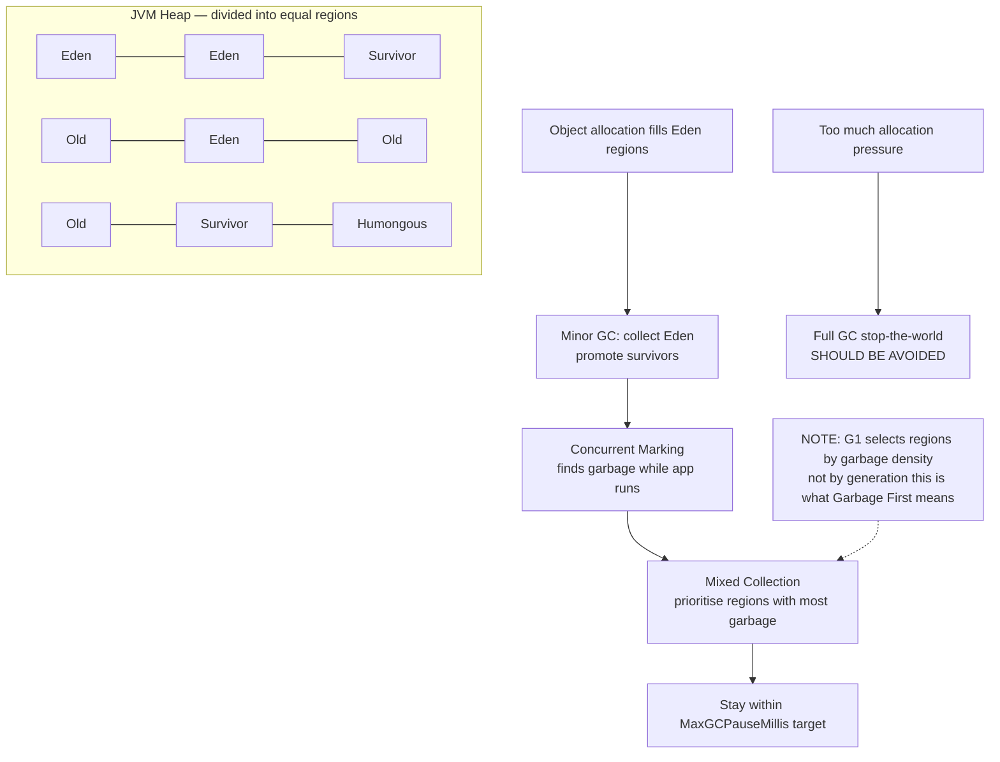
```mermaid
flowchart TD
    subgraph Heap ["JVM Heap — divided into equal regions"]
        E1[Eden] --- E2[Eden] --- S1[Survivor]
        O1[Old] --- E3[Eden] --- O2[Old]
        O3[Old] --- S2[Survivor] --- H1[Humongous]
    end

    ALLOC[Object allocation fills Eden regions] --> MINOR[Minor GC: collect Eden\npromote survivors]
    MINOR --> CONMARK[Concurrent Marking\nfinds garbage while app runs]
    CONMARK --> MIXED[Mixed Collection\nprioritise regions with most garbage]
    MIXED --> GOAL[Stay within MaxGCPauseMillis target]

    PRESSURE[Too much allocation pressure] --> FULLGC[Full GC stop-the-world\nSHOULD BE AVOIDED]

    note1[NOTE: G1 selects regions by garbage density\nnot by generation this is what Garbage First means]
    note1 -.-> MIXED
```

---

## Object Header Layout

Every Java object has a header before its fields. On a 64-bit JVM the header consists of two machine words: the **mark word** and the **klass pointer**. The mark word (8 bytes) encodes the object's identity hash code, GC age (how many collections it has survived), lock state (biased, thin, or fat lock), and a GC forwarding pointer during collection. The klass pointer references the class metadata in Metaspace. With compressed OOPs enabled (the default), the klass pointer shrinks to 4 bytes, giving a 12-byte header, padded to 16 bytes for alignment. An object with no fields is still 16 bytes. An `Integer` (one int field) is also 16 bytes. This is why boxing primitives quadruples memory consumption compared to bare int arrays.

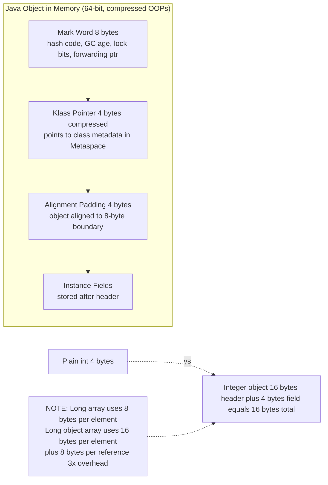
```mermaid
flowchart LR
    subgraph ObjectLayout ["Java Object in Memory (64-bit, compressed OOPs)"]
        direction TB
        MARK["Mark Word 8 bytes\nhash code, GC age, lock bits, forwarding ptr"]
        KLASS["Klass Pointer 4 bytes compressed\npoints to class metadata in Metaspace"]
        PAD["Alignment Padding 4 bytes\nobject aligned to 8-byte boundary"]
        FIELDS["Instance Fields\nstored after header"]
        MARK --> KLASS --> PAD --> FIELDS
    end

    INT[Plain int 4 bytes] -. vs .-> BOX[Integer object 16 bytes header plus 4 bytes field equals 16 bytes total]

    note1[NOTE: Long array uses 8 bytes per element\nLong object array uses 16 bytes per element\nplus 8 bytes per reference 3x overhead]
    note1 -.-> BOX
```

---

## Generics Type Erasure

Java generics are a compile-time feature only. The compiler checks types, inserts casts, and then **erases** all generic type information before emitting bytecode. At runtime, `List<String>` and `List<Integer>` are both just `List`. The JVM has no awareness of what T was — this was a deliberate backward-compatibility decision that required zero JVM changes. The downside is that you cannot do `new T()`, `new T[]`, or `instanceof List<String>` — the information simply does not exist at runtime. You recover it with a `Class<T>` token or by using an anonymous subclass to capture the type in the supertype signature — the classic type-token pattern used by Jackson's `TypeReference`.

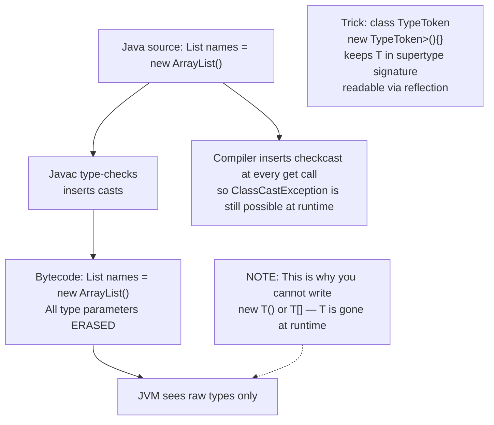
```mermaid
flowchart TD
    SOURCE["Java source: List<String> names = new ArrayList<String>()"] --> COMPILE[Javac type-checks\ninserts casts]
    COMPILE --> BYTECODE["Bytecode: List names = new ArrayList()\nAll type parameters ERASED"]
    BYTECODE --> JVM[JVM sees raw types only]

    CAST[Compiler inserts checkcast at every get call\nso ClassCastException is still possible at runtime]
    SOURCE --> CAST

    TRICK["Trick: class TypeToken<T>\nnew TypeToken<List<String>>(){}\nkeeps T in supertype signature\nreadable via reflection"]

    note1["NOTE: This is why you cannot write\nnew T() or T[] — T is gone at runtime"]
    note1 -.-> JVM
```

---

## Bridge Methods

When a class overrides a generic method from a supertype, type erasure creates a signature mismatch. If you implement `Comparable<String>` with `compareTo(String s)`, the JVM's raw `Comparable` interface expects `compareTo(Object o)`. The compiler generates a **synthetic bridge method** with the erased signature that casts its argument and delegates to your real method. This bridge is what the polymorphic call site hits; your typed method handles the actual logic. Bridge methods are invisible in source code but visible in decompiled bytecode and through reflection via `Method.isBridge()`.

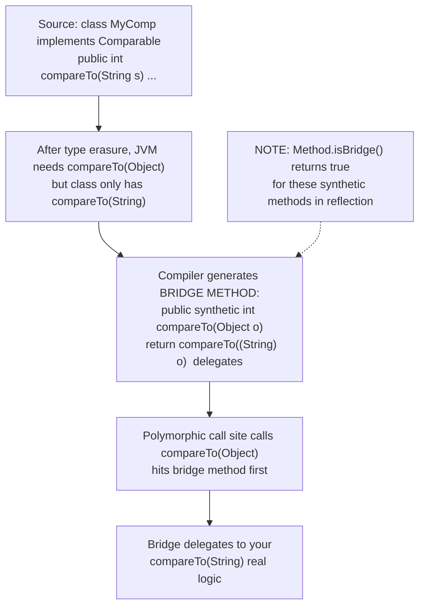
```mermaid
flowchart TD
    SOURCE["Source: class MyComp implements Comparable<String>\n  public int compareTo(String s) ..."] --> COMPILE

    COMPILE["After type erasure, JVM needs compareTo(Object)\nbut class only has compareTo(String)"]

    BRIDGE["Compiler generates BRIDGE METHOD:\npublic synthetic int compareTo(Object o)\n  return compareTo((String) o)  delegates"]

    CALLERS["Polymorphic call site calls compareTo(Object)\nhits bridge method first"]

    COMPILE --> BRIDGE
    BRIDGE --> CALLERS
    CALLERS --> REAL["Bridge delegates to your\ncompareTo(String) real logic"]

    note1["NOTE: Method.isBridge() returns true\nfor these synthetic methods in reflection"]
    note1 -.-> BRIDGE
```

---

## Double-Checked Locking

Double-checked locking is a lazy initialisation pattern that checks the instance reference before and after acquiring the lock — avoiding synchronisation overhead once initialised. The classic implementation without `volatile` was broken due to instruction reordering: the JVM can write the reference to the field before the object is fully initialised. A second thread passes the first null check, sees a non-null reference, and returns a half-initialised object. Declaring the field `volatile` prevents the reordering. A simpler and safer alternative is the **Initialisation-On-Demand Holder** pattern, which leverages class loading guarantees — no synchronisation required at all.

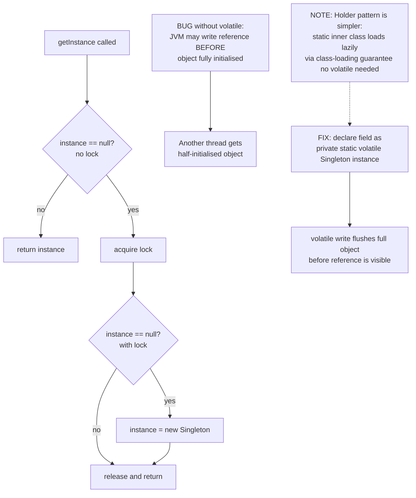
```mermaid
flowchart TD
    GET[getInstance called] --> C1{instance == null?\nno lock}
    C1 -- no --> RET[return instance]
    C1 -- yes --> LOCK[acquire lock]
    LOCK --> C2{instance == null?\nwith lock}
    C2 -- no --> UNLOCK[release and return]
    C2 -- yes --> CREATE[instance = new Singleton]
    CREATE --> UNLOCK

    REORDER[BUG without volatile:\nJVM may write reference BEFORE\nobject fully initialised]
    REORDER --> HALFOBJ[Another thread gets\nhalf-initialised object]

    FIX["FIX: declare field as\nprivate static volatile Singleton instance"]
    FIX --> SAFE[volatile write flushes full object\nbefore reference is visible]

    note1[NOTE: Holder pattern is simpler:\nstatic inner class loads lazily\nvia class-loading guarantee no volatile needed]
    note1 -.-> FIX
```

---

## readResolve

Java serialisation normally bypasses constructors when reconstructing objects. For singletons this is catastrophic: deserialising gives you a second instance, breaking the pattern. If you define a `readResolve()` method on a `Serializable` class, the deserialisation machinery calls it after constructing the object and uses its return value as the final result — discarding the newly constructed copy. You return the canonical instance. This works for enums automatically; you cannot deserialise a duplicate enum constant because the JVM handles it at the language level.

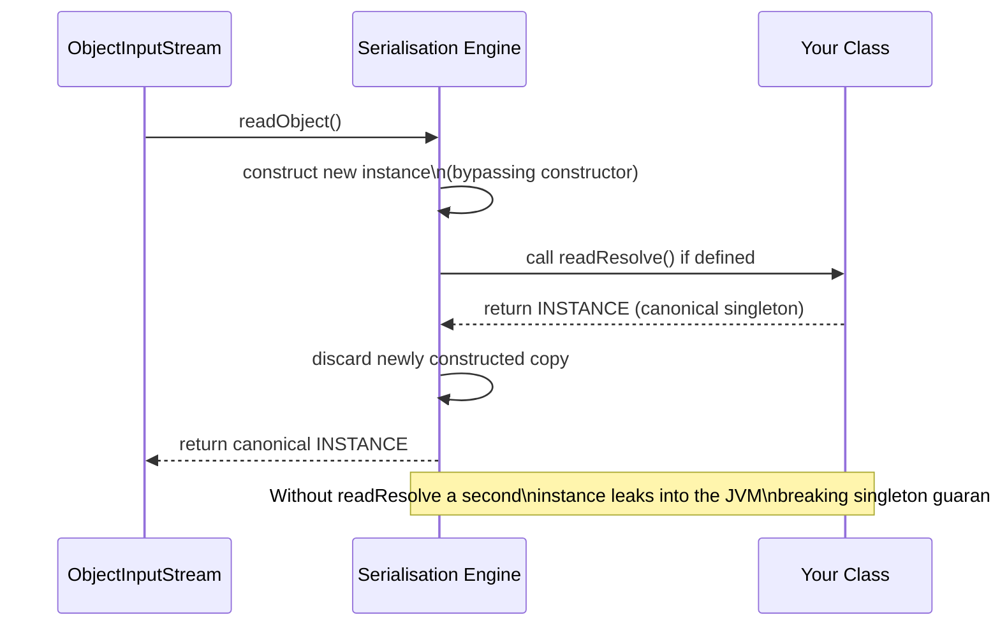
```mermaid
sequenceDiagram
    participant S as ObjectInputStream
    participant C as Serialisation Engine
    participant R as Your Class

    S->>C: readObject()
    C->>C: construct new instance\n(bypassing constructor)
    C->>R: call readResolve() if defined
    R-->>C: return INSTANCE (canonical singleton)
    C->>C: discard newly constructed copy
    C-->>S: return canonical INSTANCE

    Note over C,R: Without readResolve a second\ninstance leaks into the JVM\nbreaking singleton guarantee
```

---

## SerialVersionUID

When Java serialises an object, it writes a fingerprint of the class — the `serialVersionUID` — into the byte stream. On deserialisation it computes the current class's fingerprint and compares. A mismatch throws `InvalidClassException`. If you omit the declaration, Java auto-computes the UID from class name, interfaces, methods, and fields. This auto-computed value is sensitive to innocuous changes like adding a private helper method or recompiling with a different JDK version. Declaring it explicitly as `private static final long serialVersionUID = 1L` pins the version, giving you full control over backward compatibility. The deeper principle: serialisation makes your class definition part of your data format.

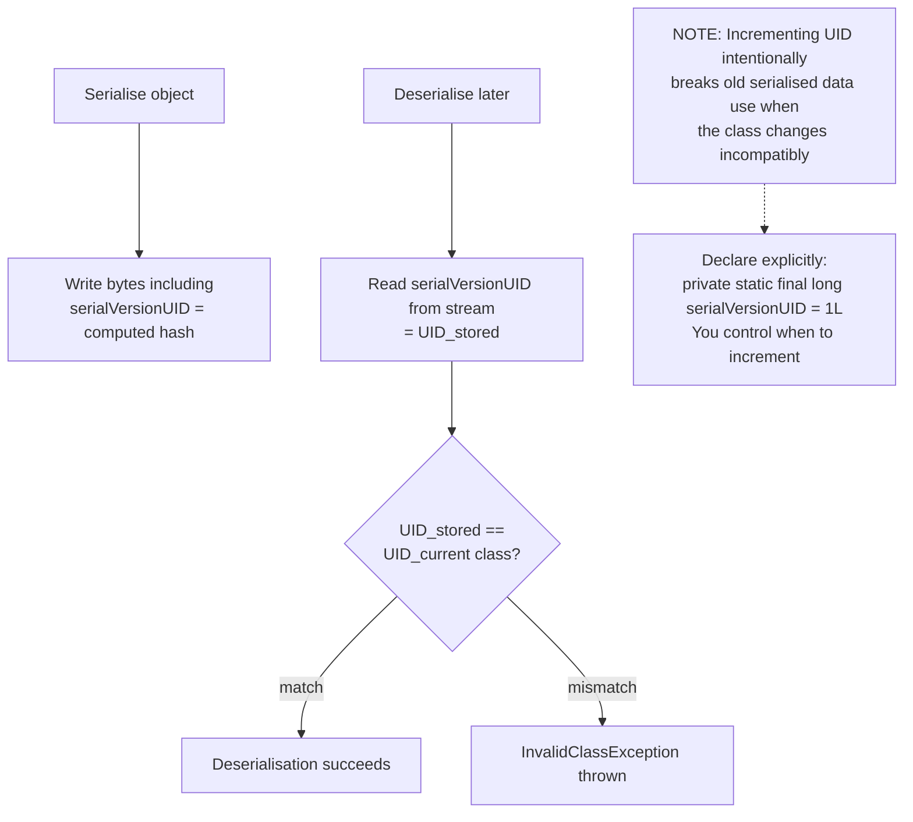
```mermaid
flowchart TD
    SER[Serialise object] --> WRITE["Write bytes including\nserialVersionUID = computed hash"]

    DESER[Deserialise later] --> READ["Read serialVersionUID from stream\n= UID_stored"]
    READ --> COMPARE{UID_stored ==\nUID_current class?}
    COMPARE -- match --> OK[Deserialisation succeeds]
    COMPARE -- mismatch --> ERR[InvalidClassException thrown]

    FIX["Declare explicitly:\nprivate static final long serialVersionUID = 1L\nYou control when to increment"]

    note1[NOTE: Incrementing UID intentionally\nbreaks old serialised data use when\nthe class changes incompatibly]
    note1 -.-> FIX
```

---

## StampedLock Optimistic Reads

`StampedLock` adds a third locking mode beyond read and write: **optimistic read**. You sample the write counter (acquiring a stamp without actually locking), perform your read, then validate the stamp. If no write occurred in the interim, you're done — zero lock overhead. If a write did happen, you fall back to a real read lock. This pattern is extremely fast when reads vastly outnumber writes because the common path involves no synchronisation at all. The critical constraint: the code between `tryOptimisticRead()` and `validate()` must not have side effects and must tolerate reading potentially inconsistent data — the validation is what makes it safe.

```mermaid
flowchart TD
    OPT[tryOptimisticRead sample write counter as stamp] --> READ[Read x and y without locking]
    READ --> VAL{validate stamp\nhas any write occurred?}
    VAL -- valid: no write --> USE[Use x and y safely FAST PATH]
    VAL -- invalid: write happened --> RLOCK[Acquire real readLock]
    RLOCK --> REREAD[Re-read x and y under lock]
    REREAD --> RUNLOCK[readLock unlock]
    RUNLOCK --> USE

    note1[NOTE: Code between tryOptimisticRead\nand validate must be free of side effects\nand safe to re-execute]
    note1 -.-> READ
```

---

## NIO Selector Internals

Java NIO's `Selector` enables one thread to monitor many `Channel`s simultaneously rather than dedicating a thread per connection. Internally it wraps OS-level multiplexing: `epoll` on Linux, `kqueue` on macOS. You register each channel with a set of interest operations (`OP_READ`, `OP_WRITE`, `OP_ACCEPT`, `OP_CONNECT`). Calling `select()` blocks until at least one registered channel is ready. You iterate `selectedKeys()` to find ready channels and handle them. A very common bug: if you do not remove the key from the selected set after handling it, the selector keeps returning it even when nothing new has happened, causing a busy-loop. This is the foundation of Netty, Tomcat NIO mode, and virtually every high-performance Java server.

```mermaid
flowchart TD
    CHAN1[Channel 1: client socket] --> REG
    CHAN2[Channel 2: server socket] --> REG
    CHAN3[Channel 3: another client] --> REG

    REG[Register channels with Selector\ninterest: READ, WRITE, ACCEPT] --> SELECT[selector.select blocks\nuntil at least one channel ready]

    SELECT --> KEYS[iterate selectedKeys]
    KEYS --> CHECK{key.isReadable?\nkey.isWritable?}
    CHECK -- READ --> HANDLE_R[read from channel]
    CHECK -- WRITE --> HANDLE_W[write to channel]
    HANDLE_R --> REMOVE[REMOVE key from selectedKeys set]
    HANDLE_W --> REMOVE

    REMOVE --> SELECT

    note1[NOTE: Forgetting to remove the key\ncauses a tight busy-loop the most common NIO bug]
    note1 -.-> REMOVE
```

---

## DirectByteBuffer Lifecycle

A `DirectByteBuffer` allocates memory in native (off-heap) space rather than the Java heap. This is essential for I/O operations: data being transferred to or from the OS must not move during the transfer, but the GC can relocate heap objects at any time. Direct buffers are pinned at a fixed native address. The lifecycle problem: they are managed by Java heap objects via a `Cleaner` (a phantom reference). When the Java object is GC'd, the Cleaner frees the native memory. But the Java heap may not feel pressure even as native memory fills up — `OutOfMemoryError: Direct buffer memory` can occur while the Java heap is mostly empty. Control the total allocation with `-XX:MaxDirectMemorySize`.

```mermaid
flowchart TD
    ALLOC["ByteBuffer.allocateDirect(size)"] --> NATIVE[Allocate native memory\noff-heap, fixed address]
    ALLOC --> JAVA[Create DirectByteBuffer Java object\non heap with Cleaner attached]

    IO[IO operations use native address directly\nno GC relocation risk] --> NATIVE

    GC[Java object becomes unreachable] --> CLEANER[Cleaner phantom reference fires]
    CLEANER --> FREE[Native memory freed]

    PROBLEM[Java heap not under pressure\nGC does not run\nNative memory fills up] --> OOM[OutOfMemoryError: Direct buffer memory\nJava heap still mostly empty]

    note1[NOTE: Pool and reuse DirectByteBuffers\nNetty ByteBuf pool exists for this exact reason]
    note1 -.-> ALLOC
```

---

## ClassLoader Delegation Model

Java's class loading uses a parent-first delegation hierarchy. When a classloader is asked to load a class it first delegates to its parent. The chain is: Bootstrap (loads `java.*` from the JDK modules) then Platform/Extension (loads `javax.*`, extensions) then Application (loads your classpath). This prevents you from accidentally overriding a JDK class — Bootstrap always wins. The critical implication for multi-classloader environments (OSGi, application servers): if two different classloaders independently load the same fully-qualified class name from different JARs, the JVM treats them as **completely different types**, causing `ClassCastException` even though the class names are identical.

```mermaid
flowchart TD
    APP[Application ClassLoader\nloads your classpath] --> PLAT[Platform ClassLoader\nloads javax.* extensions]
    PLAT --> BOOT[Bootstrap ClassLoader\nloads java.* core JDK]

    REQUEST[Load com.example.MyClass] --> APP
    APP -- delegate first --> PLAT
    PLAT -- delegate first --> BOOT
    BOOT -- not found --> PLAT
    PLAT -- not found --> APP
    APP -- found in classpath --> LOADED[Class loaded by Application CL]

    DANGER[Two classloaders load same class name\nfrom different JARs] --> DIFF[JVM sees TWO distinct types\nClassCastException if you mix them]

    note1[NOTE: OSGi deliberately breaks parent delegation\nfor module isolation each bundle has its own CL]
    note1 -.-> DANGER
```

---

## JIT Inlining Heuristics

Method inlining is the most impactful JIT optimisation: the JIT copies a callee's bytecode into the caller, eliminating call overhead and enabling further optimisations like constant propagation, escape analysis, and dead code elimination. The heuristics are size and frequency driven. A method is inlined if its bytecode is smaller than `MaxInlineSize` (default ~35 bytes). Hot methods (compiled at high tier) get a larger threshold controlled by `FreqInlineSize` (up to ~325 bytes). Methods that are too large, have too many call sites, or dispatch polymorphically to more than two types resist inlining. The lesson: small, focused methods are not just good design — they are JIT-friendly.

```mermaid
flowchart TD
    CALL[Method call site] --> CHECK{Method bytecode\nsize check}
    CHECK -- size less than MaxInlineSize 35 bytes --> INLINE_ALWAYS[Always inline]
    CHECK -- size less than FreqInlineSize 325 bytes AND hot --> INLINE_HOT[Inline at hot threshold]
    CHECK -- too large or cold --> NO_INLINE[Not inlined call overhead remains]

    INLINE_ALWAYS --> OPTS[Further optimisations enabled:\nconstant folding, escape analysis\ndead code elimination]
    NO_INLINE --> OVERHEAD[Call, stack frame, argument passing overhead]

    POLY[Polymorphic call site\n3+ receiver types] --> MEGAMORPHIC[Megamorphic cannot inline efficiently\nJIT uses virtual dispatch table]

    note1[NOTE: Small focused methods win twice:\nbetter design AND better JIT inlining]
    note1 -.-> INLINE_ALWAYS
```

---

## Deoptimisation

The JIT compiles code speculatively — it assumes that a virtual call always dispatches to `SubclassA` and inlines it. If `SubclassB` arrives at runtime, the assumption is violated and the JIT must **deoptimise**: discard the compiled code for that method, fall back to the interpreter for the current frame (on-stack replacement), and eventually recompile with weaker assumptions. Deoptimisation is normal and expected — it happens during class loading when new subclasses appear, when infrequent branches are suddenly taken, or when uncommon trap conditions are hit. The risk is a mass deoptimisation event under unusual input patterns that causes a sudden throughput drop in production.

```mermaid
flowchart TD
    JIT[JIT compiles method with assumption:\nonly SubclassA ever appears] --> FAST[Optimised native code\nSubclassA inlined very fast]

    RUNTIME[SubclassB arrives at runtime] --> TRAP[Uncommon trap fires\nassumption violated]
    TRAP --> DEOPT[Deoptimise: discard compiled code\nfall back to interpreter for current frame]
    DEOPT --> RECOMP[Recompile with weaker assumption:\nbimorphic or virtual dispatch]

    RECOMP --> SLOWER[Slightly slower than fully inlined\nbut correct for all subtypes]

    note1[NOTE: Monitor with -XX:+PrintDeoptimization\nor JFR DeoptimizationEvent\nMass deopt can cause sudden production slowdowns]
    note1 -.-> TRAP
```

---

## @Transactional Proxy

Spring's `@Transactional` works through AOP proxy objects. When you inject a service bean, Spring provides a proxy wrapping the real object. Calling a `@Transactional` method calls the proxy, which opens a transaction, delegates to your real method, and commits or rolls back on return. The most common gotcha is **self-invocation**: if `methodA()` calls `this.methodB()` (both annotated), it bypasses the proxy entirely — no transaction is started for `methodB`. Private methods are silently ignored — CGLIB cannot proxy them. Catching and swallowing an exception inside the method causes a commit even though you handled a failure.

```mermaid
sequenceDiagram
    participant C as Caller
    participant P as Spring Proxy CGLIB
    participant S as Your Service real object
    participant DB as Database

    C->>P: call transactionalMethod()
    P->>DB: BEGIN TRANSACTION
    P->>S: delegate to real method
    S->>DB: execute SQL
    alt no exception
        S-->>P: normal return
        P->>DB: COMMIT
    else RuntimeException
        S-->>P: throws exception
        P->>DB: ROLLBACK
    end
    P-->>C: return result

    Note over C,P: SELF-INVOCATION BUG: calling this.method()\nskips proxy no transaction for inner call
```

---

## CGLIB

CGLIB (Code Generation Library) is a bytecode manipulation library Spring uses when JDK dynamic proxies are unavailable — that is, when your class does not implement an interface. CGLIB generates a subclass of your concrete class at runtime and overrides all eligible methods to insert AOP advice or transaction management. The generated class name appears in stack traces as `YourClass$$EnhancerBySpringCGLIB$$abc123`. The constraints: your class must not be `final` (CGLIB cannot subclass final classes), and target methods must be public or protected and non-final. Records and sealed classes are inherently final, which is one of the architectural pressures driving Spring toward interface-based design.

```mermaid
flowchart TD
    SPRING[Spring detects @Transactional\nor AOP advice needed] --> CHECK{Does class\nimplement interface?}
    CHECK -- YES --> JDK[JDK Dynamic Proxy\nproxies the interface]
    CHECK -- NO --> CGLIB_GEN[CGLIB generates subclass\nat runtime via ASM bytecode manipulation]

    CGLIB_GEN --> SUB["YourService$$EnhancerByCGLIB$$xxx\noverrides all non-final public/protected methods"]
    SUB --> INTERCEPT[Each overridden method calls\nMethodInterceptor chain before/after delegation]

    LIMIT1[final class CANNOT subclass] --> FAIL[BeanCreationException]
    LIMIT2[final method cannot override] --> SKIP[Advice silently skipped]

    note1[NOTE: Spring Boot 2.x+ defaults to CGLIB\neven for interfaces via proxy-target-class=true]
    note1 -.-> CGLIB_GEN
```

---

## MethodHandles

`MethodHandles` provides a modern, JIT-friendly alternative to `java.lang.reflect`. A `MethodHandle` is a typed, directly invocable reference to a method, constructor, or field. Unlike reflection, `MethodHandle` invocations can be JIT-inlined, boxless, and allocation-free for primitive arguments. Lookup objects carry the caller's access rights — you can look up private methods of the enclosing class. `MethodHandles` are the implementation mechanism for `invokedynamic`, lambda expressions (`LambdaMetafactory` wraps a handle to the lambda body), and dynamic language dispatch.

```mermaid
flowchart TD
    LOOKUP[MethodHandles.lookup in caller class] --> FIND["findVirtual, findStatic, findConstructor\nfindGetter, findSetter"]
    FIND --> MH[MethodHandle typed invokable reference]
    MH --> INVOKE[mh.invoke or mh.invokeExact\nJIT can inline like a regular call]

    LAMBDA["Lambda: () -> x + 1"] --> INDY[invokedynamic call site]
    INDY --> LMF[LambdaMetafactory creates MethodHandle\nto lambda body]
    LMF --> FUNCIF[Wrapped in Functional Interface\nno extra allocation after first call]

    note1[NOTE: invokeExact requires exact type match\ninvoke does automatic widening/narrowing\nPrefer invokeExact for performance]
    note1 -.-> INVOKE
```

---

## VarHandle

`VarHandle`, introduced in Java 9, generalises `MethodHandle` to variable access — instance fields, static fields, and array elements — with fine-grained memory ordering semantics. You choose from four access modes: **plain** (no ordering), **opaque** (prevents dead-code elimination but no cross-thread guarantee), **release-acquire** (establishes happens-before), and **volatile** (full volatile semantics). The big benefit: `AtomicInteger`-like CAS operations on ordinary primitive fields without wrapper object allocation. The JDK rewrote `Atomic` classes internally to use `VarHandle` for exactly this reason.

```mermaid
flowchart TD
    subgraph "Access Modes weakest to strongest"
        PLAIN[Plain no ordering\nbest for single-threaded or already-guarded access]
        OPAQUE[Opaque no reorder past this point\nno cross-thread visibility]
        ACQREL["Release-Acquire establishes happens-before\nbetween release write and acquire read"]
        VOL[Volatile full sequential consistency\nstrongest guarantee]
        PLAIN --> OPAQUE --> ACQREL --> VOL
    end

    VH["VarHandle vh = lookup.findVarHandle(MyClass.class, count, int.class)"] --> CAS["vh.compareAndSet(obj, expected, update)\nCAS on plain int field no boxing"]

    note1[NOTE: JDK AtomicInteger internals\nnow use VarHandle instead of Unsafe\nfor type safety without performance loss]
    note1 -.-> CAS
```

---

## TLAB — Thread-Local Allocation Buffer

Allocating objects on the heap without TLABs would require atomic synchronisation on every allocation. TLABs solve this by giving each thread a private chunk of Eden space. Allocation within the TLAB simply bumps the thread's local pointer — no synchronisation, essentially as cheap as stack allocation. When the TLAB is exhausted, the thread requests a new one, requiring only brief synchronisation. Very large objects that exceed the TLAB size are allocated directly in Eden or Old generation with synchronisation, which is why large objects are relatively expensive to allocate frequently.

```mermaid
flowchart TD
    subgraph Eden ["Eden Space"]
        TLAB1[Thread 1 TLAB\nprivate chunk]
        TLAB2[Thread 2 TLAB\nprivate chunk]
        TLAB3[Thread 3 TLAB\nprivate chunk]
        FREE[Free Eden space]
    end

    T1[Thread 1: new Object] --> PTR1[bump Thread 1 local pointer\nno synchronisation needed]
    PTR1 --> TLAB1

    EXHAUST[TLAB exhausted] --> REQUEST[Request new TLAB from JVM\nbrief global synchronisation]
    REQUEST --> NEWCHUNK[New chunk assigned from Free space]

    LARGE["Very large object > TLAB"] --> DIRECT[Allocate directly in Eden or Old gen\nrequires synchronisation]

    note1[NOTE: Tune with -XX:TLABSize\nMany TLAB misses in GC logs suggest\nobjects too large for default TLAB]
    note1 -.-> REQUEST
```

---

## Sealed Classes

Sealed classes, introduced in Java 17, restrict which classes may extend or implement a type by declaring the permitted subclasses explicitly. This serves one primary purpose: enabling **exhaustive pattern matching**. When the compiler knows all possible subtypes, it can verify that your `switch` expression handles every case, giving you the same safety as an enum while allowing subclasses to have different fields and methods. Sealed classes pair naturally with records to create algebraic data type patterns — the Java equivalent of Scala sealed traits or Haskell sum types.

```mermaid
flowchart TD
    SEALED["sealed interface Shape\npermits Circle, Rectangle, Triangle"] --> C[final class Circle\n  double radius]
    SEALED --> R[final class Rectangle\n  double width, height]
    SEALED --> T[final class Triangle\n  double base, height]

    SWITCH["switch expression on Shape"] --> CHECK[Compiler checks\nall permits listed covered]
    CHECK -- all covered --> OK[No default needed\nCompiler guarantees exhaustiveness]
    CHECK -- case missing --> WARN[Compile error: missing case Triangle]

    note1[NOTE: Sealed plus Record is the Java idiom\nfor algebraic data types ADTs\nEnables safe exhaustive domain modelling]
    note1 -.-> SWITCH
```

---

## Lock Inflation

Java's `synchronized` locking passes through several states to optimise the common uncontended case. A new object starts **unlocked**. The first thread to lock it acquires a **biased lock** — just a thread ID written into the mark word. Future locks by the same thread are essentially free. When a second thread attempts to lock the biased object, the bias is revoked at a safe point, and the lock inflates to a **thin lock** — implemented with a CAS on the mark word. Under sustained contention where CAS keeps failing, the lock inflates to a **fat lock** — an OS monitor is allocated, and blocking threads are parked by the OS. Modern JVMs (Java 15+) deprecated biased locking.

```mermaid
stateDiagram-v2
    [*] --> Unlocked : object created
    Unlocked --> BiasedLock : first thread locks\nstore thread ID in mark word
    BiasedLock --> BiasedLock : same thread re-locks\nnearly free check
    BiasedLock --> ThinLock : second thread contends\nbias revoked at safepoint
    ThinLock --> ThinLock : CAS on mark word succeeds\nfast path no OS call
    ThinLock --> FatLock : CAS keeps failing\nOS monitor allocated
    FatLock --> FatLock : threads park via OS\nblocking expensive
    FatLock --> Unlocked : all threads release

    note right of BiasedLock : Deprecated in Java 15+\nhardware CAS fast enough
    note right of FatLock : Once inflated stays fat\nfor lifetime of object
```

---

## Write Barriers

A write barrier is code the GC inserts around every reference write in your application. When you write `a.field = b`, you may create a reference from an old-generation object to a young-generation object, or cross a G1 region boundary. Without tracking this, the GC would have to scan the entire old generation to find references into the young generation during a minor collection. Write barriers maintain **remembered sets** — one per region in G1 — recording cross-region references as they occur. During a young collection, the GC scans only remembered sets, not the whole heap. Write barriers also implement concurrent mark invariants.

```mermaid
flowchart TD
    WRITE["a.field = b (reference write in application code)"] --> BARRIER[Write Barrier code executes]
    BARRIER --> CHECK{Is b in a\ndifferent GC region?}
    CHECK -- YES --> REMSET["Record in b region's\nRemembered Set: a points here"]
    CHECK -- NO --> SKIP[No action needed]

    COLLECT[Young Collection begins] --> SCAN[Scan Remembered Sets of young regions\nfind all old-gen pointers into young]
    SCAN --> AVOID[Avoid scanning ALL of old gen\n= fast minor GC]

    CONMARK[Concurrent Mark] --> SNAP["SATB barrier: snapshot references\nbeing overwritten before they vanish"]

    note1[NOTE: Write barriers add a small constant\noverhead to every reference store\nThis is an inherent GC cost you cannot eliminate]
    note1 -.-> BARRIER
```

---

## DispatcherServlet

`DispatcherServlet` is Spring MVC's front controller. Every HTTP request enters through it, and it orchestrates the entire request lifecycle. It uses `HandlerMapping` to find which controller handles the request, `HandlerAdapter` to invoke the handler, `MessageConverter` for REST response serialisation, and `ViewResolver` to resolve logical view names for server-side rendering. The pipeline runs: pre-handler interceptors, then the handler, then post-handler interceptors, then view rendering (or response writing for `@ResponseBody`), then after-completion interceptors.

```mermaid
sequenceDiagram
    participant C as HTTP Client
    participant DS as DispatcherServlet
    participant HM as HandlerMapping
    participant I as Interceptors
    participant CTRL as Your Controller
    participant MSG as MessageConverter

    C->>DS: HTTP Request
    DS->>HM: find handler for URL + method
    HM-->>DS: HandlerExecutionChain
    DS->>I: preHandle
    DS->>CTRL: invoke handler method
    CTRL-->>DS: return value or ModelAndView
    DS->>I: postHandle
    alt REST response
        DS->>MSG: serialise return value to JSON
        MSG-->>C: HTTP Response with body
    else MVC view
        DS-->>C: render HTML response
    end
    DS->>I: afterCompletion
```

---

## Stream Short-Circuiting

Certain stream terminal operations are **short-circuit**: they produce a result without processing the entire stream. `findFirst`, `findAny`, `anyMatch`, `allMatch`, `noneMatch`, and `limit` are all short-circuit. In a pipeline with `filter` followed by `findFirst`, elements are processed one at a time until one passes the filter — the pipeline stops immediately. This is why infinite streams (`Stream.iterate(0, n -> n+1)`) are usable with short-circuit terminals. The deeper principle is that all stream intermediate operations are lazy — they do not execute until a terminal operation is called. The terminal drives the pipeline, pulling elements through only as needed.

```mermaid
flowchart LR
    SRC["Stream.iterate(0, n -> n+1)\ninfinite sequence: 0,1,2,3..."] --> FILTER["filter(n -> n % 2 == 0)\n2,4,6,8..."]
    FILTER --> FIND["findFirst SHORT CIRCUIT"]
    FIND --> RESULT["Returns Optional.of(0)\nSTOPS immediately rest never computed"]

    LAZY[Intermediate ops do NOT execute\nuntil terminal is called] --> PULL[Terminal PULLS elements\none at a time through the pipeline]
    PULL --> STOP[Short-circuit terminal STOPS\nas soon as answer is known]

    note1["NOTE: Stream.of(...).count()\nif SIZED characteristic present\noptimises away the traversal entirely"]
    note1 -.-> FIND
```

---

## Spliterator

`Spliterator` (Splitting Iterator) is the data-source abstraction behind parallel streams. Like an iterator it traverses elements; unlike one it can **split itself**, yielding two `Spliterator`s each covering roughly half the source. `ForkJoinPool` uses this to recursively decompose data for parallel execution. Spliterators also advertise **characteristics**: `SIZED`, `ORDERED`, `DISTINCT`, `SORTED`, `IMMUTABLE`. These characteristics enable optimisations — `SIZED` allows `count()` to short-circuit; `UNORDERED` lets certain parallel operations skip order-preserving overhead. Implementing a custom `Spliterator` makes any data structure play well with `Stream.parallel()`.

```mermaid
flowchart TD
    DATA[Your data source e.g. ArrayList of 1M elements] --> SPLIT1[Spliterator covering 0..999999]
    SPLIT1 -- trySplit --> LEFT[Spliterator 0..499999]
    SPLIT1 -- trySplit --> RIGHT[Spliterator 500000..999999]
    LEFT -- trySplit --> LL[0..249999]
    LEFT -- trySplit --> LR[250000..499999]

    FJP[ForkJoinPool] --> SPLIT1
    FJP --> WORKERS[Worker threads process\neach sub-spliterator in parallel]

    CHARS[Characteristics flags] --> SIZED[SIZED: count without traversal]
    CHARS --> ORDERED[ORDERED: must maintain encounter order]
    CHARS --> DISTINCT[DISTINCT: skip distinct step]

    note1[NOTE: UNORDERED parallel streams\ncan be significantly faster they skip\norder maintenance in collect operations]
    note1 -.-> CHARS
```

---

## Try-With-Resources

Try-with-resources ensures that `AutoCloseable` resources are closed reliably. The compiler transforms the syntax into a `try-finally` with individually guarded close calls for each resource, in reverse declaration order. The critical improvement over manual `try-finally`: if both the body and a `close()` call throw, the close exception is attached to the original exception as a **suppressed exception** via `addSuppressed()`, rather than replacing it. In manual `try-finally` the close exception would swallow the original — the bug you actually cared about would vanish.

```mermaid
flowchart TD
    SOURCE["try (A a = ...; B b = ...) { body }"] --> EXPAND[Compiler expands to:]
    EXPAND --> OPEN_A[open A]
    OPEN_A --> OPEN_B[open B]
    OPEN_B --> BODY[execute body]
    BODY --> CLOSE_B[close B first\nin own try-catch]
    CLOSE_B --> CLOSE_A[close A second\nin own try-catch]

    BOTH_THROW[body throws E1\nclose throws E2] --> ATTACH["E2 attached as suppressed\nE1.getSuppressed() returns E2\nE1 is the primary exception"]

    MANUAL_BUG[Manual try-finally:\nclose exception REPLACES body exception\nE1 is lost forever] --> BAD[Original bug invisible]

    note1[NOTE: Always use try-with-resources\nfor any Closeable or AutoCloseable\nNever rely on manual finally-close]
    note1 -.-> ATTACH
```

---

# 🗄️ Part 2 — Databases and Distributed Systems

---

## Indexing

An index is a separate data structure the database maintains alongside table data to speed up lookups. Without an index, the database must examine every row — a **full table scan** — to find matching rows. With a B-tree index, it navigates a sorted tree structure to locate matches in O(log n) operations. Indexes trade write overhead for read speed: every insert, update, or delete must also update all relevant indexes. The art of indexing is choosing which columns to index based on your actual query patterns, because over-indexing slows writes without proportionate read benefit.

```mermaid
flowchart TD
    QUERY["SELECT * FROM orders WHERE customer_id = 42"] --> CHECK{Index on\ncustomer_id?}
    CHECK -- NO --> SCAN["Full Table Scan\nread every row O(n)"]
    CHECK -- YES --> BTREE["B-tree index lookup\nO(log n) navigation"]
    BTREE --> ROWS[Jump directly to matching rows]
    SCAN --> SLOW[Slow on large tables]
    ROWS --> FAST[Fast regardless of table size]

    WRITE[INSERT or UPDATE] --> UPDATE_INDEX[Must update ALL indexes on table]
    UPDATE_INDEX --> WRITE_COST[Write cost increases with number of indexes]

    note1[NOTE: Index only what you actually query\nover-indexing harms write throughput\nand wastes storage]
    note1 -.-> UPDATE_INDEX
```

---

## Clustering, Denormalisation, and Normalisation

Normalisation structures a relational database to eliminate data redundancy — each fact stored exactly once, updates happen in one place, no anomalies. Normal forms from 1NF through BCNF codify increasingly strict rules. Denormalisation is the deliberate reversal: you duplicate data to avoid expensive joins, accepting that updates must propagate to multiple places. A clustered index physically stores table rows in index order. In MySQL InnoDB every table has exactly one clustered index — the primary key. Leaf nodes of the B-tree are the actual rows. Secondary indexes store the primary key as a pointer, so a secondary index lookup requires two B-tree traversals.

```mermaid
flowchart TD
    subgraph NORM ["Normalised schema"]
        USER_T[users: user_id, name, email]
        ORDER_T[orders: order_id, user_id, amount]
        ORDER_T -- JOIN --> USER_T
    end

    subgraph DENORM ["Denormalised schema"]
        ORDER_D[orders: order_id, user_name, user_email, amount\nDuplicated user data]
    end

    NORM --> FAST_WRITE[Single update location\nno anomalies]
    DENORM --> FAST_READ[No JOIN needed on read\nfaster queries]
    DENORM --> SLOW_WRITE[Must update user_name in EVERY order row]

    CLUSTER[Clustered Index: rows physically sorted by PK\nPK lookup = one B-tree traversal] --> SECONDARY[Secondary index: stores PK pointer\nlookup = two B-tree traversals]

    note1[NOTE: Normalise first, denormalise\nonly where measurement proves it necessary]
    note1 -.-> DENORM
```

---

## Read Replicas and Replication Modes

A read replica is a copy of the primary database that handles SELECT queries. Changes replicate from primary to replicas via WAL shipping or logical replication. The critical limitation is **replication lag**: the replica is always slightly behind the primary. Never use a replica for reads that must immediately follow a write. Leader-follower (single-leader) replication sends all writes to one leader; multi-leader allows multiple nodes to accept writes, enabling geographic distribution but requiring conflict resolution when two leaders concurrently update the same row.

```mermaid
flowchart TD
    PRIMARY[Primary Node\nhandles ALL writes] --> REP1[Replica 1\nhandles reads]
    PRIMARY --> REP2[Replica 2\nhandles reads]
    PRIMARY --> REP3[Replica 3\nhandles reads]

    WRITE[Application write] --> PRIMARY
    READ_STALE[Application read non-critical] --> REP1
    READ_FRESH[Application read must be fresh] --> PRIMARY

    LAG[Replication Lag: replicas are\nalways slightly behind primary] --> PROBLEM[Write then immediate read on replica\nmay miss your own write]

    subgraph MULTILEADER ["Multi-Leader Replication"]
        L1[Leader Region A] -- sync --> L2[Leader Region B]
        L2 -- sync --> L1
        CONFLICT[CONFLICT: both update same row concurrently] --> RESOLVE[Resolution strategy needed:\nlast-write-wins, CRDT, or app-level merge]
    end

    note1[NOTE: Always read from primary for\ncritical consistency checks like\npayment confirmations]
    note1 -.-> PRIMARY
```

---

## Quorum and Consensus

In a distributed system with N replicas, operations require agreement from a **quorum** — typically a majority of nodes. For writes requiring acknowledgement from W nodes and reads querying R nodes, if W + R > N, at least one node seen by a read must have participated in the last write, guaranteeing the latest data is always seen. Consensus algorithms like **Raft** solve the harder problem of getting distributed nodes to agree on a sequence of values even when nodes fail. Raft elects a leader by timeout, the leader appends entries to its log and replicates to followers, and commits once a majority acknowledges.

```mermaid
flowchart TD
    subgraph QUORUM ["Quorum (N=5, W=3, R=3)"]
        W[Write: must reach 3 of 5 nodes] --> N1[Node 1 ACK]
        W --> N2[Node 2 ACK]
        W --> N3[Node 3 ACK]
        N4[Node 4 no ACK needed]
        N5[Node 5 no ACK needed]
    end

    MATH[W + R = 6 greater than N = 5\nAt least 1 overlap guaranteed\nReads always see latest write]

    subgraph RAFT ["Raft Consensus"]
        direction LR
        LEAD[Leader: accepts writes\nappends to log] --> F1[Follower 1]
        LEAD --> F2[Follower 2]
        LEAD --> F3[Follower 3]
        COMMIT[Committed when majority ACK] --> RESP[Respond to client]
        TIMEOUT[Leader timeout] --> ELECT[Election: follower with\nmost complete log wins]
    end

    note1[NOTE: Lower W means faster writes\nbut less durability tune based on\nyour consistency requirements]
    note1 -.-> QUORUM
```

---

## CAP Theorem and BASE vs ACID

CAP states a distributed system guarantees at most two of: **Consistency** (every read sees the most recent write), **Availability** (every request receives a response), and **Partition tolerance** (operation continues during network splits). Since network partitions will occur, you are really choosing between C and A during a partition. ACID — Atomicity, Consistency, Isolation, Durability — describes traditional database guarantees. BASE — Basically Available, Soft state, Eventually consistent — describes many distributed and NoSQL systems that trade ACID's hard guarantees for higher availability and performance.

```mermaid
flowchart TD
    subgraph CAP ["CAP Triangle"]
        C[Consistency\nevery read = latest write]
        A[Availability\nevery request gets a response]
        P[Partition Tolerance\nworks during network splits]
        C --- A
        A --- P
        P --- C
    end

    REAL[Real distributed systems must handle partitions] --> CHOICE{During partition\nchoose:}
    CHOICE -- Consistency --> REFUSE[Refuse requests\nthat cannot reach quorum]
    CHOICE -- Availability --> STALE[Serve possibly stale data\nreturn best available answer]

    ACID_BOX["ACID: Atomicity, Consistency\nIsolation, Durability\nStrong guarantees, harder to scale"] --> RDBMS[PostgreSQL, MySQL]
    BASE_BOX["BASE: Basically Available\nSoft state, Eventually consistent\nScale easily, weaker guarantees"] --> NOSQL[Cassandra, DynamoDB, CouchDB]

    note1[NOTE: PACELC extends CAP:\neven without partitions there is a\nlatency vs consistency tradeoff]
    note1 -.-> CAP
```

---

## MVCC and Snapshot Isolation

MVCC (Multi-Version Concurrency Control) eliminates the reader-writer blocking problem by storing **multiple versions** of each row. Writers create new versions without overwriting old ones. Readers see the version that was current at their transaction's start time — effectively a snapshot of the database. This is how PostgreSQL achieves excellent read throughput under write load: readers never block writers and vice versa. Snapshot Isolation prevents dirty reads and non-repeatable reads but allows **write skew** — two transactions each check a condition, both find it satisfied, and together their writes violate it. Serializable Snapshot Isolation (SSI) detects write skew at commit time.

```mermaid
flowchart LR
    subgraph MVCC_ROWS ["Row Versions in MVCC"]
        direction TB
        V1["version 1: salary=50000 txn_id=100 deleted=null"]
        V2["version 2: salary=60000 txn_id=150 deleted=null"]
        V3["version 3: salary=70000 txn_id=200 deleted=null"]
        V1 --> V2 --> V3
    end

    TX1["Transaction started at txn_id=120\nsees version 1 only (V2 created after start)"] --> V1
    TX2["Transaction started at txn_id=160\nsees version 2 only"] --> V2
    LATEST["Current transaction\nsees version 3"] --> V3

    VACUUM[Autovacuum cleans old versions\nno longer visible to any active transaction]

    note1[NOTE: Long-running transactions prevent\nvacuum from cleaning old versions causes table bloat\nThis is why idle transactions are dangerous]
    note1 -.-> VACUUM
```

---

## Two-Phase Commit and Three-Phase Commit

Two-Phase Commit (2PC) coordinates an atomic transaction across multiple nodes. Phase one: the coordinator asks all participants if they can commit. Each durably logs its vote. Phase two: if all voted yes, the coordinator logs a commit decision and tells everyone to commit. The critical problem: if the coordinator crashes after participants voted yes but before it sends the final decision, participants are stuck — they cannot commit or abort without the coordinator. This **blocking problem** persists until the coordinator recovers. Three-Phase Commit adds a pre-commit phase to reduce this window, but 3PC assumes synchronous networks and fails under network partitions.

```mermaid
sequenceDiagram
    participant CO as Coordinator
    participant P1 as Participant 1
    participant P2 as Participant 2

    Note over CO,P2: Phase 1 PREPARE
    CO->>P1: prepare?
    CO->>P2: prepare?
    P1-->>CO: yes (durably logged)
    P2-->>CO: yes (durably logged)

    Note over CO,P2: Phase 2 COMMIT
    CO->>CO: log COMMIT decision
    CO->>P1: commit
    CO->>P2: commit
    P1-->>CO: ack
    P2-->>CO: ack

    Note over CO: BLOCKING PROBLEM: if coordinator crashes\nafter participants vote YES but before\nsending COMMIT decision, participants\nare stuck waiting forever
```

---

## WAL, Checkpointing, and Compaction

Write-Ahead Logging ensures durability: before any data page is modified on disk, a log record describing the change is written to the WAL. Only after the log record is durably on disk is the change considered committed. On crash, the database replays the WAL from the last checkpoint to recover committed changes not yet in data files, and rolls back uncommitted ones. A checkpoint is the point in the WAL at which all modified pages before it have been flushed to disk, bounding recovery time. Compaction, relevant to LSM-tree engines, merges accumulated sorted files (SSTables), discards deleted and overwritten values, and reduces the number of files that reads must scan.

```mermaid
flowchart TD
    subgraph WAL_FLOW ["Write-Ahead Log Flow"]
        WRITE[Application write] --> LOG[Write log record to WAL\nfdatasync durable]
        LOG --> ACK[ACK to client: committed]
        LOG -.-> DATA[Data page updated later\nin background]
    end

    CRASH[System crash] --> REPLAY[On restart: replay WAL\nfrom last checkpoint]
    REPLAY --> REDO[REDO committed changes\nnot yet in data files]
    REPLAY --> UNDO[UNDO uncommitted changes\nincomplete transactions]

    CHECKPOINT[Checkpoint: flush all dirty pages to disk\nTruncate WAL before checkpoint point] --> FAST_RECOVERY[Shorter WAL to replay on crash]

    COMPACT[Compaction: merge SSTables\ndiscard tombstones and old versions] --> LESS_FILES[Fewer files to scan on read\nsmaller storage footprint]

    note1[NOTE: PostgreSQL checkpoint_completion_target\nspreads checkpoint IO over time\nto avoid IO spikes]
    note1 -.-> CHECKPOINT
```

---

## Bloom Filter and LSM Tree vs B-Tree

A Bloom filter answers set-membership queries with no false negatives but configurable false positives. Internally it is a bit array with multiple hash functions: to add, hash the element and set those bit positions; to query, check if all positions are set. If any position is zero the element is definitely absent. Cassandra uses Bloom filters to avoid checking SSTables that cannot contain a queried key. LSM trees optimise for writes: writes go to an in-memory memtable, flushed to immutable sorted SSTables on disk. Compaction merges SSTables. B-trees modify pages in place, making random reads fast but writes expensive due to scattered page updates.

```mermaid
flowchart LR
    subgraph BLOOM ["Bloom Filter"]
        BIT["Bit array: 0 0 0 0 0 0 0 0"]
        ADD["add('apple'): set positions 2,5,7"] --> BIT
        QUERY["query('banana'): check positions 1,4,6\nposition 1 = 0 DEFINITELY NOT in set"] --> MISS[Skip SSTable entirely]
    end

    subgraph LSM ["LSM Tree Write Path"]
        MEMTABLE[MemTable in RAM\nsorted, mutable] --> FLUSH[Flush to SSTable on disk\nimmutable sorted file]
        FLUSH --> L0[Level 0 SSTables]
        L0 --> COMPACT_L[Compaction merges into\nLevel 1, 2, 3 fewer larger files]
    end

    subgraph BTREE ["B-Tree Write Path"]
        PAGE[Find and lock data page] --> MODIFY[Modify page in place]
        MODIFY --> WAL2[Write WAL record]
        WAL2 --> WRITE_BACK[Write modified page back to disk]
    end

    note1[NOTE: LSM excels for write-heavy workloads\nB-tree excels for read-heavy with random lookups\nChoose engine based on your workload]
    note1 -.-> LSM
```

---

## Query Planner and Cost-Based Optimizer

The query planner parses your SQL and generates an execution plan. The **cost-based optimiser** evaluates multiple candidate plans and selects the cheapest, estimating cost from table statistics: row counts, column cardinality, value distribution histograms, and correlation. For a join the optimiser chooses between nested-loop join (good for small tables), hash join (good for large unsorted inputs), and merge join (good for pre-sorted inputs). With N tables there are N! possible join orders — optimisers use dynamic programming or greedy heuristics to explore the search space. A large discrepancy between estimated and actual rows in `EXPLAIN ANALYZE` signals stale statistics — run `ANALYZE` to refresh.

```mermaid
flowchart TD
    SQL["SELECT * FROM orders o JOIN users u ON o.user_id = u.id WHERE u.country = 'IN'"] --> PARSE[Parse into AST]
    PARSE --> STATS[Gather table statistics:\nrow counts, histograms, indexes]
    STATS --> PLANS[Generate candidate plans]

    subgraph Plans
        P1["Plan A: Seq Scan users Hash Join orders\ncost estimate: 5000"]
        P2["Plan B: Index Scan users by country Nested Loop\ncost estimate: 120"]
        P3["Plan C: Seq Scan orders Hash Join users\ncost estimate: 8000"]
    end

    PLANS --> SELECT_PLAN[Cost-based optimiser selects Plan B]
    SELECT_PLAN --> EXEC[Execute Plan B]

    STALE[Stale statistics: estimated 10 rows\nactual 100000 rows] --> WRONG_PLAN[Wrong plan chosen nested loop\nbecomes catastrophically slow]
    STALE --> FIX[Run ANALYZE to refresh statistics]

    note1[NOTE: EXPLAIN ANALYZE is your debugging tool\nCheck estimated vs actual rows large gaps mean stale stats]
    note1 -.-> STATS
```

---

## Deadlock and Lock Types

A deadlock occurs when transaction A holds a lock transaction B needs and vice versa — both wait forever. Databases detect deadlocks using a **wait-for graph**: a cycle means deadlock. One transaction is chosen as victim and killed, allowing others to proceed. Prevention: always acquire locks in a consistent order across all transactions; keep transactions short; prefer MVCC to avoid locking entirely where possible. Lock escalation replaces many fine-grained row locks with a coarser table lock when the number of locks exceeds a threshold. **Optimistic locking** (version columns) acquires no locks and validates at commit. **Pessimistic locking** (`SELECT FOR UPDATE`) holds locks during the transaction.

```mermaid
flowchart TD
    subgraph DEADLOCK ["Deadlock Scenario"]
        TX_A[Transaction A holds lock on Row 1\nwaits for Row 2]
        TX_B[Transaction B holds lock on Row 2\nwaits for Row 1]
        TX_A -- waits --> TX_B
        TX_B -- waits --> TX_A
        CYCLE[CYCLE DETECTED DEADLOCK]
    end

    DETECT[Database detects cycle in wait-for graph] --> VICTIM[Choose victim transaction\ntypically one with fewest resources used]
    VICTIM --> KILL[Victim rolled back\nError returned to application]
    KILL --> RETRY[Application MUST catch and retry]

    subgraph LOCK_TYPES
        OPT[Optimistic: no lock\ncheck version at commit\nfail if changed] --> LOW_CONT[Best for low contention]
        PESS[Pessimistic: SELECT FOR UPDATE\nblock all concurrent writes] --> HIGH_CONT[Best when conflict is expected]
    end

    note1[NOTE: Always acquire locks in consistent\nalpha or PK order to prevent deadlock cycles]
    note1 -.-> DEADLOCK
```

---

## Isolation Anomalies

SQL defines four isolation levels, each preventing a subset of anomalies. **Dirty read**: reading uncommitted data that may be rolled back. **Non-repeatable read**: the same row returns different values within one transaction because another committed a change. **Phantom read**: a range query returns different rows on re-execution because another transaction inserted or deleted matching rows. **Read skew**: reading two related rows that form an inconsistent snapshot — prevented by Snapshot Isolation. **Write skew**: two transactions each read a shared condition, decide to write based on it, and together violate the invariant — prevented only by Serializable.

```mermaid
flowchart TD
    subgraph LEVELS ["Isolation Level vs Anomaly Prevention"]
        RC[Read Committed\nSELECT sees only committed rows]
        RR[Repeatable Read\nrow values stable within transaction]
        SI[Snapshot Isolation\nconsistent snapshot at start time]
        SER[Serializable\nexecution equivalent to serial]
        RC --> RR --> SI --> SER
    end

    DIRTY[Dirty Read: read uncommitted data] --> RC
    NONREP[Non-Repeatable Read: row changes mid-txn] --> RR
    PHANTOM[Phantom Read: new rows appear mid-txn] --> SER
    RSKEW[Read Skew: inconsistent snapshot] --> SI
    WSKEW[Write Skew: both check condition\nboth write and together violate it] --> SER

    EXAMPLE["Write Skew example: 2 doctors check\nat least 2 on-call? both see YES\nboth mark themselves off-call\nresult: 0 doctors on-call WRONG"] --> SER

    note1[NOTE: Most databases default to Read Committed\nPostgreSQL SERIALIZABLE uses SSI to detect\nwrite skew with low overhead]
    note1 -.-> LEVELS
```

---

## Backpressure, Circuit Breaker, and Rate Limiting

Backpressure is a flow-control signal from a downstream component telling an upstream to slow down production. Instead of dropping data or crashing, the upstream pauses until downstream catches up. Reactive Streams builds backpressure into the protocol between publisher and subscriber. A **circuit breaker** has three states: Closed (requests pass through), Open (requests fail fast after too many failures — no call attempted), and Half-Open (a probe request tests if downstream has recovered). This prevents cascading failures. Rate limiting restricts how many requests a specific client can make in a window. Throttling limits how many requests the service processes globally, protecting it from overload.

```mermaid
stateDiagram-v2
    [*] --> Closed : normal operation
    Closed --> Open : failure threshold exceeded\ne.g. 50% errors in 10s window
    Open --> HalfOpen : timeout elapsed\nprobe downstream
    HalfOpen --> Closed : probe succeeds\ndownstream recovered
    HalfOpen --> Open : probe fails\nstill not ready

    note right of Closed : Requests pass through\nfailures counted
    note right of Open : Requests FAIL FAST\nno network call made\nprotects downstream
    note right of HalfOpen : One request let through\nas recovery probe
```

---

## CDC, Consistent Hashing, and Partitioning

Change Data Capture (CDC) reads the database WAL to produce a real-time stream of every insert, update, and delete as events, enabling real-time integration, cache invalidation, and event sourcing. Debezium is the leading open-source CDC tool. **Consistent hashing** places both data items and nodes on a hash ring; adding or removing a node only moves data from adjacent positions, minimising redistribution. This is why Cassandra and DynamoDB can add nodes without reshuffling all data. Hash partitioning distributes rows uniformly but loses range scan ability. Range partitioning enables range scans but risks hot partitions when all writes go to the current time-range shard.

```mermaid
flowchart LR
    subgraph CDC_FLOW ["CDC Pipeline"]
        DB["PostgreSQL\nWAL"] --> DEB[Debezium connector\nreads WAL]
        DEB --> KAFKA[Kafka topic:\nrow-level change events]
        KAFKA --> CACHE[Cache invalidation service]
        KAFKA --> SEARCH[Elasticsearch indexer]
        KAFKA --> ANALYTICS[Analytics pipeline]
    end

    subgraph CONSISTENT_HASH ["Consistent Hashing Ring"]
        RING((Hash Ring\n0 to 2^32))
        N1[Node A\nangle 0] --- N2[Node B\nangle 120] --- N3[Node C\nangle 240] --- N1
        ADD[Add Node D at 60 degrees:\nonly data between 0 and 60\nmoves from Node B to Node D]
    end

    note1[NOTE: Virtual nodes vnodes in Cassandra\ngive each physical node multiple\nring positions for even data distribution]
    note1 -.-> CONSISTENT_HASH
```

---

## Idempotency and Exactly-Once Semantics

An **idempotent** operation produces the same result whether executed once or many times. `PUT` with a full resource is idempotent; `POST` to create is not. Idempotency is essential in distributed systems where retries are necessary — a timeout does not tell you if the server received your request. With idempotent operations you can safely retry. **Exactly-once semantics** guarantees a message is processed exactly once, neither lost nor duplicated. Kafka achieves this within the Kafka ecosystem: idempotent producers use sequence numbers to detect and discard duplicates, transactional producers atomically write across partitions, and consumer offset management is atomically committed with processing results.

```mermaid
flowchart TD
    REQUEST[Client sends payment request\nwith idempotency key = uuid-1234] --> SERVER[Server processes payment]
    SERVER --> STORE[Store result with idempotency key]
    SERVER --> TIMEOUT[Network timeout client unsure]

    TIMEOUT --> RETRY[Client retries with SAME uuid-1234]
    RETRY --> CHECK[Server checks idempotency key store]
    CHECK -- found --> RETURN_CACHED[Return cached result\nDO NOT process again]
    CHECK -- not found --> PROCESS[Process and store result]

    subgraph EXACTLY_ONCE ["Kafka Exactly-Once"]
        PROD[Idempotent Producer\nsequence numbers detect duplicates] --> TOPIC[Kafka Topic]
        TOPIC --> CONSUMER[Consumer reads and processes]
        CONSUMER --> ATOMIC[Commit result to DB AND\noffset to Kafka in one transaction]
    end

    note1[NOTE: External writes beyond Kafka\nrequire the external system to be idempotent\nTrue exactly-once is system-wide not just Kafka]
    note1 -.-> EXACTLY_ONCE
```

---

# 🖥️ Part 3 — Frontend Engineering

---

## Hydration and Islands Architecture

When a server renders HTML and sends it to the browser, the page looks correct but is inert — no event handlers are attached. **Hydration** is the process of attaching JavaScript event handlers and state to the already-existing server-rendered DOM. React walks the HTML, matches it against the component tree, and adopts the existing DOM nodes rather than recreating them. Full hydration requires shipping all component code to the client regardless of interactivity. **Partial hydration** hydrates only interactive parts. **Islands architecture** formalises this: the page is mostly static HTML with isolated islands of interactivity, each hydrated independently and lazily. Astro popularised this pattern — static regions have zero JavaScript cost.

```mermaid
flowchart TD
    SERVER[Server renders full HTML] --> BROWSER[Browser receives HTML\npage looks rendered]
    BROWSER --> INERT[But page is INERT\nno event handlers attached]
    INERT --> HYDR[JavaScript executes\nHydration: adopt existing DOM nodes\nattach event handlers]
    HYDR --> INTERACTIVE[Page becomes interactive]

    subgraph ISLANDS ["Islands Architecture"]
        STATIC1[Static Header HTML zero JS] --- NAV[Interactive Nav Island\nhydrate lazily]
        NAV --- STATIC2[Static Content HTML zero JS]
        STATIC2 --- CAROUSEL[Interactive Carousel Island\nhydrate on scroll-in]
        CAROUSEL --- STATIC3[Static Footer HTML zero JS]
    end

    note1[NOTE: Full hydration ships ALL JS to client\nIslands architecture ships only JS\nfor interactive components dramatic savings]
    note1 -.-> ISLANDS
```

---

## Streaming SSR and Concurrent Rendering

Traditional SSR generates the complete HTML string on the server and sends it all at once — the browser waits for the entire response before it can start rendering. **Streaming SSR** sends HTML to the browser incrementally as it is generated. React 18's `renderToPipeableStream` supports streaming with Suspense: the server sends a placeholder for suspended components, then flushes the actual content as it becomes available via an inline script swap. **Concurrent rendering** lets React interrupt, pause, abandon, and restart render work. When a higher-priority update arrives mid-render, React can abandon the current render, handle the urgent update first, and resume the background render — previously impossible.

```mermaid
sequenceDiagram
    participant S as Server
    participant B as Browser

    S->>B: send HTML head and critical content (immediate)
    B->>B: parse and render available HTML
    S->>B: stream more HTML as components resolve
    B->>B: incrementally render page builds up
    S->>B: flush deferred Suspense content via script
    B->>B: swap placeholders for real content
    Note over S,B: User sees content progressively\nnot all-at-once after full generation

    Note over B: Concurrent Rendering: React can\nabandon mid-render if higher priority\nupdate arrives e.g. user typed
```

---

## React Fiber Architecture and Reconciliation

The **Fiber** reimplementation (React 16) makes concurrent rendering possible. A fiber is a JavaScript object representing a unit of work — a node in a work-in-progress tree corresponding to a React element. Each fiber tracks component type, props, state, effects (what needs changing in the DOM), and pointers to parent, child, and sibling fibers. This explicit linked structure means React can traverse and interrupt work incrementally. The **render phase** builds a work-in-progress fiber tree (interruptible). The **commit phase** applies effects to the DOM synchronously (non-interruptible). Reconciliation diffs two fiber trees using type-based heuristics and key matching to find the minimal set of DOM changes.

```mermaid
flowchart TD
    subgraph FIBER_TREE ["Fiber Tree Work In Progress"]
        ROOT[Root Fiber] --> APP[App Fiber]
        APP --> HEADER[Header Fiber]
        APP --> MAIN[Main Fiber]
        MAIN --> LIST[List Fiber]
        LIST --> ITEM1[Item Fiber 1]
        LIST --> ITEM2[Item Fiber 2]
    end

    RENDER[Render Phase INTERRUPTIBLE] --> BUILD[Build work-in-progress fiber tree\ncompare with current tree]
    BUILD --> DIFF{Element type same?}
    DIFF -- YES --> REUSE[Reuse DOM node\nupdate props only]
    DIFF -- NO --> REPLACE[Unmount old\nmount new subtree]

    COMMIT[Commit Phase SYNCHRONOUS\ncannot be interrupted] --> DOM[Apply all effects to real DOM\ninsertions, updates, deletions]

    note1[NOTE: Keys let React match elements\nacross renders stable data IDs\nnot array indexes prevent unnecessary unmounts]
    note1 -.-> DIFF
```

---

## Virtual DOM, Structural Sharing, and Immutability

The virtual DOM is an in-memory tree representation. React diffs it against the previous version to find real DOM changes. Naive tree diffing is O(n³). React achieves O(n) with two heuristics: elements of different types produce completely different trees, and keys identify elements across renders. **Structural sharing** makes immutability efficient: a modified data structure shares unchanged subtrees with the original rather than deep-copying. Combined with referential equality checks (`newState === oldState`), this lets `React.memo` and `PureComponent` skip re-renders cheaply when data provably has not changed.

```mermaid
flowchart TD
    subgraph PREV ["Previous Virtual DOM"]
        P_UL[ul] --> P_LI1[li key=1 Alice]
        P_UL --> P_LI2[li key=2 Bob]
        P_UL --> P_LI3[li key=3 Carol]
    end

    subgraph NEXT ["Next Virtual DOM after reorder"]
        N_UL[ul] --> N_LI3[li key=3 Carol]
        N_UL --> N_LI1[li key=1 Alice]
        N_UL --> N_LI2[li key=2 Bob]
    end

    DIFF[Reconciler diffs with keys] --> MOVE["Moves DOM nodes\nno unmount no remount\nO(n) with keys"]

    NO_KEY[Without keys: reconciler compares by position\nDifferent text 3 textContent updates\nInefficient for large lists] --> SLOW_DOM[Unnecessary DOM work]

    note1[NOTE: Use stable data IDs as keys\nnever array indexes for lists that\ncan be reordered or filtered]
    note1 -.-> MOVE
```

---

## Memoization, Stale Closures, and Referential Equality

`React.memo` and `PureComponent` compare props by referential equality. Passing a new object or function literal on every render bypasses memoization — `{a:1} !== {a:1}`. `useMemo` returns a stable computed value when dependencies are unchanged. `useCallback` returns a stable function reference. The pitfalls: over-memoizing adds overhead without benefit for cheap computations; incorrect dependency arrays cause **stale closures**. A stale closure captures a variable's value at creation time. If a `useCallback` omits a state variable from its dependency array, the callback forever reads the initial value — a subtle bug that appears as a counter that does not count.

```mermaid
flowchart TD
    RENDER[Component renders] --> NEW_OBJ["Creates new object {x: 1} as prop"]
    NEW_OBJ --> MEMO[React.memo child receives prop]
    MEMO --> COMPARE{"prevProp === newProp?\n{x:1} === {x:1}"}
    COMPARE -- FALSE always, different references --> RERENDER[Child re-renders despite same data]

    FIX[Fix: useMemo to stabilise reference] --> STABLE["const obj = useMemo(() => ({x: 1}), [])"]
    STABLE --> MEMO2["Same reference on re-render\nMemo check passes skip re-render"]

    STALE["const [count, setCount] = useState(0)\nconst log = useCallback(() => console.log(count), [])\ncount never updates in callback STALE CLOSURE"] --> BUG[Always logs 0 regardless of actual count]
    FIX2["Fix: add count to deps array\nor use setCount(prev => prev + 1) functional update"] --> CORRECT[Callback always sees current count]

    note1[NOTE: eslint-plugin-react-hooks\nenforces correct dependency arrays\nAlways trust the lint rule]
    note1 -.-> FIX
```

---

## Event Loop — Macro vs Microtasks

JavaScript is single-threaded. The event loop processes one task at a time. A **macrotask** queue holds: `setTimeout` callbacks, `setInterval` callbacks, event handler callbacks, and I/O completions. A **microtask** queue holds: Promise `.then()` callbacks, `queueMicrotask()`, and `MutationObserver` callbacks. After each macrotask completes, the engine drains the **entire** microtask queue before picking the next macrotask. This means Promise resolutions run before the next `setTimeout`, before the browser repaints, before anything else. A chain of Promises resolving synchronously can delay rendering — starving the UI without appearing as a long task because each individual microtask is short.

```mermaid
flowchart TD
    TICK[Event Loop Tick] --> MACRO[Pick ONE macrotask from queue\nsetTimeout callback, click handler, etc.]
    MACRO --> EXEC[Execute macrotask to completion]
    EXEC --> MICRO{Microtask queue\nempty?}
    MICRO -- NO --> RUN_MICRO[Run next microtask\nPromise.then, queueMicrotask]
    RUN_MICRO --> MICRO
    MICRO -- YES --> REPAINT{Browser needs\nto repaint?}
    REPAINT -- YES --> RENDER[Execute requestAnimationFrame\nStyle Recalc, Layout, Paint]
    RENDER --> TICK
    REPAINT -- NO --> TICK

    note1["NOTE: setTimeout 0 is a macrotask\nPromise.resolve().then is a microtask\nMicrotask runs BEFORE next setTimeout\nEven if setTimeout was registered first"]
    note1 -.-> MICRO
```

---

## Layout Thrashing and Critical Rendering Path

**Layout thrashing** occurs when JavaScript reads then writes DOM properties alternately and rapidly. Reading a layout property like `offsetWidth` forces the browser to complete pending style calculations and layout — a forced synchronous layout. If you immediately write to the DOM and then read again, another forced layout occurs. Dozens of these in a loop destroy frame rate. Batch all reads first, then all writes. The **critical rendering path** is the sequence for the first pixel: HTML parsing builds the DOM, CSS parsing builds the CSSOM, combining them forms the render tree, layout computes geometry, paint generates pixels, and composite merges GPU layers. CSS is render-blocking. Synchronous scripts are both render-blocking and parser-blocking.

```mermaid
flowchart TD
    subgraph THRASH ["Layout Thrashing AVOID"]
        R1[read offsetWidth forced layout] --> W1[write style.width invalidates layout]
        W1 --> R2[read offsetHeight ANOTHER forced layout]
        R2 --> W2[write style.height invalidates again]
        W2 --> SLOW[60ms frame becomes 600ms]
    end

    subgraph BATCH ["Batched reads then writes CORRECT"]
        READ_ALL[read offsetWidth, offsetHeight, scrollTop\none forced layout] --> WRITE_ALL[write all style changes\none layout invalidation, resolved next frame]
    end

    subgraph CRP ["Critical Rendering Path"]
        HTML[HTML] --> DOM[DOM Tree]
        CSS[CSS] --> CSSOM[CSSOM Tree]
        DOM --- RENDER_TREE[Render Tree]
        CSSOM --- RENDER_TREE
        RENDER_TREE --> LAYOUT[Layout\ncompute geometry]
        LAYOUT --> PAINT[Paint\ngenerate pixels]
        PAINT --> COMPOSITE[Composite\nGPU merge layers]
    end

    note1[NOTE: async and defer on script tags\nprevent parser blocking\nInline critical CSS eliminates blocking CSS request]
    note1 -.-> CRP
```

---

## Tree Shaking and Code Splitting

**Tree shaking** is the elimination of unused code during bundling. Bundlers like Webpack and Rollup analyse the static ES module import-export graph and exclude any code not reachable from an entry point. This requires ES modules; CommonJS `require()` is dynamic and cannot be statically analysed. **Code splitting** divides your bundle into chunks loaded on demand. Route-based splitting loads the settings page bundle only when the user navigates there. Dynamic `import()` is the mechanism — it returns a Promise and the bundler automatically creates a separate chunk.

```mermaid
flowchart TD
    subgraph ESM ["ES Modules Tree Shakeable"]
        UTIL["utils.js exports: add, subtract, multiply"]
        APP["app.js: import {add} from './utils'\nOnly add is imported"]
        BUNDLE["Bundle contains ONLY add()\nsubtract and multiply EXCLUDED"]
    end

    subgraph CJS ["CommonJS NOT Tree Shakeable"]
        UTIL_CJS["utils.js module.exports = {add, subtract, multiply}"]
        APP_CJS["const utils = require('./utils')\nDynamic bundler cannot know which are used"]
        BUNDLE_CJS["Entire utils.js included in bundle\neven unused functions"]
    end

    SPLIT[Code Splitting] --> ENTRY["Entry chunk: core app\nloads on first visit"]
    SPLIT --> ROUTE_CHUNK["Route chunk: /settings bundle\nloads only when user visits /settings"]
    SPLIT --> DYNAMIC["import('./heavy-component')\nReturns Promise separate chunk automatically"]

    note1[NOTE: Side-effect-free modules marked\nwith sideEffects: false in package.json\nenable more aggressive tree shaking]
    note1 -.-> ESM
```

---

## Web Workers vs Service Workers and SharedArrayBuffer

**Web Workers** are general-purpose background threads for CPU-intensive computation. They cannot touch the DOM but communicate with the main thread via `postMessage`. **Service Workers** are event-driven proxy servers between your app and the network, intercepting fetch requests, managing caches, enabling offline support, and handling push notifications. They persist across browser sessions and have a lifecycle of `install`, `activate`, and `fetch` events. **SharedArrayBuffer** enables true shared memory between workers — multiple threads access the same buffer simultaneously. `Atomics` provides synchronisation primitives to coordinate access safely.

```mermaid
flowchart TD
    subgraph MAIN_THREAD ["Main Thread UI"]
        UI[User Interface DOM]
        JS[JavaScript execution]
    end

    subgraph WW ["Web Worker background thread"]
        COMPUTE[CPU-intensive computation\nimage processing, data crunching]
    end

    subgraph SW ["Service Worker network proxy"]
        INTERCEPT[Intercepts fetch requests]
        CACHE_MGR[Manages cache storage]
        PUSH[Handles push notifications]
    end

    UI -- postMessage data --> WW
    WW -- postMessage result --> UI
    COMPUTE --> NO_DOM[Cannot access DOM\ncannot block UI]

    NETWORK[Fetch request] --> SW
    SW -- cache hit --> CACHE_RESP[Serve from cache offline]
    SW -- cache miss --> NETWORK_REQ[Forward to network]

    SAB[SharedArrayBuffer] --> SHARED[Both threads access same memory\nAtomics prevents race conditions]

    note1[NOTE: SharedArrayBuffer requires\nCross-Origin-Isolated headers\nCOOP and COEP for security]
    note1 -.-> SAB
```

---

## Browser Compositing Layers and GPU Acceleration

The browser renders through four stages: **Style**, **Layout** (compute geometry and position), **Paint** (rasterise pixels for each layer), and **Composite** (merge layers on the GPU). Layout and paint are expensive. Compositing is cheap — the GPU handles it on the compositor thread, independent of the main thread. Promoting an element to its own compositor layer means changes only trigger compositing, skipping layout and paint entirely. This is why animating `transform` and `opacity` is smooth at 60fps even when the main thread is busy. Animating `width` or `top` triggers layout — avoid it for animations. `CSS containment` (`contain: layout`) limits the scope of layout recalculation.

```mermaid
flowchart TD
    subgraph PIPELINE ["Rendering Pipeline"]
        STYLE[Style\ncompute CSS properties] --> LAYOUT[Layout\ncompute geometry, positions]
        LAYOUT --> PAINT[Paint\nrasterise pixels per layer]
        PAINT --> COMPOSITE[Composite\nGPU merges layers and displays]
    end

    TRANSFORM[Animate transform or opacity] --> COMP_ONLY[Compositor thread handles\nno layout no paint\nsmooth 60fps]
    WIDTH[Animate width or top] --> LAYOUT_TRIGGER[Triggers layout recalc\nthen paint then composite\njanky avoid]

    WILL_CHANGE["will-change: transform\nor transform: translateZ(0)"] --> PROMOTE[Element promoted\nto own compositor layer]
    PROMOTE --> OFFSCREEN[GPU caches this layer\nchanges are cheap]

    CONTAIN["contain: layout"] --> SCOPE[Limits layout recalc\nto within this element only\ndoes not propagate outward]

    note1[NOTE: Over-promoting creates too many layers\neach layer costs GPU memory\nOnly promote elements that actually animate]
    note1 -.-> PROMOTE
```

---

## Service Worker Lifecycle and Cache Strategies

A Service Worker installs when first registered, waits in the **waiting** state while tabs using the old worker remain open, then **activates** when all old tabs are closed. Common lifecycle traps: new service worker not activating immediately because old tabs are open; forgetting to delete old caches in the `activate` event. Cache strategies: **cache-first** serves from cache and only goes to network on miss — ideal for versioned static assets. **Network-first** always tries network and falls back to cache on failure. **Stale-while-revalidate** serves cached content immediately while fetching an update in the background for next time.

```mermaid
stateDiagram-v2
    [*] --> Parsed : browser registers SW
    Parsed --> Installing : install event fires
    Installing --> Installed : caches filled successfully
    Installing --> Redundant : install fails
    Installed --> Activating : no old SW controlling pages
    Installed --> Waiting : old SW still controls open tabs
    Waiting --> Activating : all old tabs closed\nor skipWaiting called
    Activating --> Activated : activate event fires\nclean up old caches here
    Activated --> Activated : handles fetch events\ncontrols all matching pages
    Activated --> Redundant : replaced by newer SW

    note right of Waiting
        Most common confusion point:
        new SW registered but not taking effect
        because old tab is still open
    end note
```

---

## CORS, CSP, and Security Primitives

CORS restricts cross-origin resource requests. Simple requests are sent with an `Origin` header; the server must respond with `Access-Control-Allow-Origin` to permit access. Non-simple requests — those with custom headers or non-simple methods — trigger a **preflight** OPTIONS request first. **CSP** (Content Security Policy) is a response header declaring permitted sources for scripts, styles, and images. `script-src 'self'` blocks all injected inline scripts, defeating most XSS attacks. **Trusted Types** go further: requiring all dangerous DOM sinks like `innerHTML` to receive a Trusted value created through a defined policy, preventing DOM-based XSS at the browser level.

```mermaid
sequenceDiagram
    participant B as Browser
    participant API as api.example.com
    participant EXT as external.com

    Note over B,API: Simple CORS request
    B->>API: GET /data (Origin: app.example.com)
    API-->>B: Access-Control-Allow-Origin: app.example.com
    B->>B: Allow origins match

    Note over B,EXT: Preflight for non-simple request
    B->>EXT: OPTIONS /upload (preflight)
    B->>EXT: Origin, Access-Control-Request-Method: POST
    B->>EXT: Access-Control-Request-Headers: Authorization
    EXT-->>B: Access-Control-Allow-Origin, Allow-Methods, Allow-Headers
    B->>EXT: Actual POST request (if preflight passed)

    Note over B: CSP: Content-Security-Policy header\nscript-src 'self' blocks inline scripts\nTrusted Types: innerHTML must receive TrustedHTML object
```

---

## Suspense, Selective Hydration, and Server Components

**Suspense boundaries** wrap parts of the component tree that may suspend — throw a Promise during rendering to signal they are loading. The boundary shows a fallback while children are suspended. **Selective hydration** (React 18+) allows parts of the page to hydrate as they stream in. If a user clicks an un-hydrated region, React prioritises hydrating that part first — interaction drives hydration priority. **React Server Components** never run in the browser: they execute on the server, output a serialised React tree, and have zero client-side JS cost. Client components are regular React components that hydrate. RSC is the next major architectural shift in React.

```mermaid
flowchart TD
    subgraph SUSPENSE_TREE ["Component Tree with Suspense"]
        APP[App] --> HEADER_READY[Header already hydrated]
        APP --> SUSP1[Suspense boundary]
        SUSP1 --> SLOW[SlowDataComponent still loading]
        SUSP1 --> FALLBACK[Shows loading spinner]
        APP --> SUSP2[Suspense boundary]
        SUSP2 --> FAST[FastComponent ready]
        FAST --> HYDRATED[Hydrated and interactive]
    end

    CLICK[User clicks un-hydrated region] --> PRIORITY[React prioritises hydrating\nthat region first]

    subgraph RSC ["Server vs Client Components"]
        SC[Server Component\nexecutes on server\naccess DB directly\nzero client JS] --> SERIAL[Serialised RSC payload\nwire format]
        SERIAL --> CC[Client Component\nhydrates normally\nevent handlers work]
    end

    note1[NOTE: RSC payload is NOT HTML\nit is a React-specific serialisation\nthat the client renderer understands]
    note1 -.-> RSC
```

---

## Web Vitals — LCP, CLS, INP, and FID

**LCP** (Largest Contentful Paint) measures when the largest visible content element — typically the hero image or main text block — finishes rendering. Target: under 2.5 seconds. **CLS** (Cumulative Layout Shift) measures unexpected visual instability — elements moving after apparent page load. An image without reserved dimensions causes content to jump when it loads. Target: below 0.1. **FID** (First Input Delay) measured delay from first interaction to browser starting to handle it — now superseded by **INP** (Interaction to Next Paint), which measures the worst interaction latency across the entire page visit. INP became a Core Web Vital in 2024. Target: under 200ms.

```mermaid
flowchart TD
    LOAD[Page loads] --> LCP_EVENT[LCP: largest element renders\nTarget: under 2.5 seconds]
    LOAD --> CLS_EVENT[CLS: layout shifts accumulate\nTarget: below 0.1 score]

    IMG[Image loads without height reserved] --> SHIFT[Content jumps down layout shift]
    SHIFT --> CLS_BAD[High CLS score bad UX]
    FIX_CLS["Fix: img {aspect-ratio: 16/9}\nreserve space before image loads"] --> CLS_GOOD[Zero shift good CLS]

    INTERACT[User interactions throughout visit] --> INP[INP: worst interaction measured\nfrom input to next paint\nTarget: under 200ms]

    LONG_TASK[Long JavaScript task blocks main thread\n500ms task means 500ms INP on that click] --> INP_BAD[High INP sluggish page]
    FIX_INP[Break long tasks into smaller chunks\nuse scheduler.yield between tasks] --> INP_GOOD[Each task under 50ms responsive]

    note1[NOTE: INP replaced FID as Core Web Vital in March 2024\nFID only measured the first interaction\nINP measures ALL interactions much harder to optimise]
    note1 -.-> INP
```

---

## CRDTs and Offline Conflict Resolution

CRDTs (Conflict-free Replicated Data Types) are data structures mathematically designed so that concurrent modifications from multiple sources can always be merged without conflicts and without coordination. The simplest is the **G-Set**: elements can only be added, never removed, so any two replicas merge with set union. A **LWW-Register** (Last-Write-Wins) keeps the value with the highest timestamp. For collaborative text editing, **Sequence CRDTs** (as in Yjs and Automerge) give every character a unique identifier so concurrent insertions at the same position can be deterministically ordered without a server round-trip. Yjs is the standard library for collaborative web applications.

```mermaid
flowchart TD
    subgraph GSET ["G-Set CRDT (grow-only)"]
        USER_A["User A set: {apple, banana}"] --> MERGE
        USER_B["User B set: {banana, cherry}"] --> MERGE
        MERGE["Merge = Union: {apple, banana, cherry}\nAlways convergent no conflicts possible"]
    end

    subgraph LWW ["LWW-Register"]
        WRITE_A["User A: value=hello timestamp=100"] --> LWW_MERGE
        WRITE_B["User B: value=world timestamp=150"] --> LWW_MERGE
        LWW_MERGE["Result: world (higher timestamp wins)\nDeterministic with no coordination"]
    end

    subgraph TEXT_CRDT ["Sequence CRDT (Yjs)"]
        INS_A["User A inserts 'a' at position 2\nID: (A, 1)"] --> BOTH
        INS_B["User B inserts 'b' at position 2\nID: (B, 1)"] --> BOTH
        BOTH["Both see: ...a b... or ...b a...\ndeterministic tie-break by ID\nSame result on all replicas"]
    end

    note1[NOTE: CRDTs enable true peer-to-peer collaboration\nwith no server arbitration required\nFigma and Notion use sequence CRDTs internally]
    note1 -.-> TEXT_CRDT
```

---

## AbortController, Streaming Fetch, and Memory Leaks

**AbortController** is the standard cancellation mechanism for async operations. You pass its `signal` to `fetch()`; calling `abort()` causes the fetch to reject with `AbortError`. The same signal can cancel multiple operations simultaneously. This is essential for preventing race conditions and for component cleanup on unmount. **Streaming fetch** lets you process responses before they are fully received — `response.body` is a `ReadableStream`. Read chunks with a reader as they arrive, perfect for streaming LLM responses. Browser memory leaks come from: event listeners not removed on unmount, closures capturing large objects, and **detached DOM nodes** — elements removed from the document but still referenced in JavaScript.

```mermaid
flowchart TD
    subgraph ABORT ["AbortController pattern"]
        CTRL[const ctrl = new AbortController] --> SIG[ctrl.signal passed to fetch]
        SIG --> FETCH[fetch url signal=ctrl.signal]
        NEW_REQUEST[New search input arrives] --> ABORT_PREV[ctrl.abort cancel in-flight request]
        ABORT_PREV --> REJECT[fetch rejects with AbortError]
        NEW_REQUEST --> NEW_FETCH[Start new fetch with new controller]
    end

    subgraph LEAK ["Memory Leak Sources"]
        EV[window.addEventListener in component\nno removeEventListener on unmount] --> DETACH_HANDLER[Handler holds reference to component\ncomponent never GC'd]
        DOM_REF[Remove element from DOM\nbut keep ref in JS object] --> DETACH_DOM[Detached DOM node GC cannot collect]
        CLOSURE_LEAK[Closure captures large array or dataset\nclosure itself kept alive by timer or listener] --> DATA_LEAK[Data never freed]
    end

    STREAMING[response.body.getReader] --> CHUNK[reader.read returns chunk]
    CHUNK --> PROCESS[process chunk immediately\nrender partial response]
    CHUNK -- done=false --> CHUNK

    note1[NOTE: Chrome DevTools Memory tab\nshows Detached DOM nodes directly\nTake heap snapshots before and after\nto find what grew]
    note1 -.-> LEAK
```

---

## Accessibility Tree and ARIA Live Regions

Every DOM element has a corresponding node in the **accessibility tree** — a parallel structure consumed by screen readers and assistive technology. The tree is built from semantic HTML and ARIA attributes. A `div` has no semantic role; a `button` element has `role=button` automatically. Screen readers announce roles, states (`aria-expanded`, `aria-disabled`), and labels (`aria-label`, `aria-labelledby`). **ARIA live regions** tell screen readers to announce content changes automatically without the user focusing the element. `aria-live="polite"` waits until the user finishes their current activity. `aria-live="assertive"` interrupts immediately — reserve for critical urgent messages only. Misusing `assertive` floods the user with interruptions.

```mermaid
flowchart TD
    subgraph DOM_TREE ["DOM Tree"]
        D_DIV[div class=card]
        D_H2[h2 Product Name]
        D_BTN["button Add to Cart"]
        D_LIVE["div aria-live=polite status messages"]
        D_DIV --> D_H2
        D_DIV --> D_BTN
        D_DIV --> D_LIVE
    end

    subgraph A11Y_TREE ["Accessibility Tree"]
        A_GENERIC[generic role no semantics for div]
        A_HEAD[heading level 2]
        A_BTN[button role focusable, activatable]
        A_LIVE[live region polite announces changes]
        A_GENERIC --> A_HEAD
        A_GENERIC --> A_BTN
        A_GENERIC --> A_LIVE
    end

    DOM_TREE -.->|browser builds| A11Y_TREE

    TOAST[Toast notification: Order placed!] --> LIVE_UPDATE[Update aria-live div content]
    LIVE_UPDATE --> ANNOUNCE[Screen reader announces automatically\nwithout user focusing element]

    note1[NOTE: Test with VoiceOver on macOS\nNVDA on Windows or screen reader of choice\nAXE browser extension checks common ARIA errors]
    note1 -.-> A11Y_TREE
```

---

## How to Render These Diagrams

Every diagram in this document is written in **Mermaid** syntax. You can render them in several ways.

Paste any diagram block into [mermaid.live](https://mermaid.live) for an instant interactive, editable render — no install required. GitHub and GitLab render Mermaid inside fenced code blocks marked with ` ```mermaid ` natively, so this file will display diagrams automatically if you commit it to a repository. Notion and Confluence both support Mermaid as a built-in block type. VS Code users can install the **Mermaid Preview** or **Markdown Preview Mermaid Support** extension to see diagrams inline while editing.

For offline or CI use, the Mermaid CLI tool (`mmdc`) converts diagrams to SVG or PNG: install with `npm install -g @mermaid-js/mermaid-cli` and run `mmdc -i diagram.mmd -o diagram.svg`.

The three diagram types used in this document are `flowchart` (top-down `TD` and left-right `LR` variants for process flows and architecture), `sequenceDiagram` (for protocol and lifecycle interactions between participants), and `stateDiagram-v2` (for state machines like lock inflation and service worker lifecycle).

---

*Generated by Claude — Anthropic. Every concept explained from first principles.*
